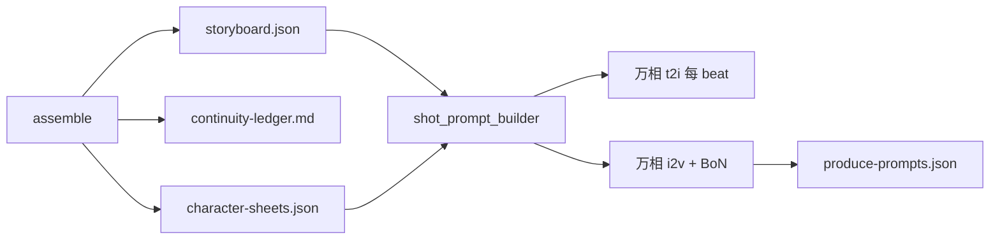

# 项目内 Agent Skills

flow-agent 将技能写在 **`.cursor/skills/`**，运行时由 [`internal/agent/skills`](../internal/agent/skills) 加载，并在 LLM / 万相 i2v 时**自动注入**。

## 技能列表

### micro-movie-director（导演手册）

| Reference | 维度 |
|-----------|------|
| `camera-language.md` | 景别、角度、运镜、构图、轴线 |
| `visual-polish.md` | 光影、色调、景深、材质、抗伪影 |
| `character-performance.md` | 四拍表演、微表情、重心 |
| `costume-and-identity.md` | 锁定词、服饰分层、换装规则 |
| `staging-and-detail.md` | 前中后景、道具、环境反应 |
| `physics-logic.md` | physics_cues / forbidden、PhysVid/WMReward |
| `continuity-ledger.md` | 跨镜台账 |
| `review-rubric.md` | 8 维审查量表 |
| `ai-video-shot-template.md` | 分镜 JSON 模板 |
| `produce-motion-checklist.md` | i2v 短约束（≤40 字/条） |

### physics-realism（成片物理）

| Reference | 用途 |
|-----------|------|
| `wmreward-bon.md` | 多候选选优配置 |
| `physvid-negative.md` | negative physics 句式 |
| `physics-iq-checklist.md` | 回归评测 |

## 分阶段注入与 Token 上限

| Stage | References | maxRefRunes |
|-------|------------|-------------|
| `expand_brief_segment` | camera, costume, staging, performance | 6000 |
| `expand_brief_continue` | continuity-ledger, performance | 4000 |
| `generate_shots` | 上述 + visual-polish, physics-logic, ai-video-shot-template, review-rubric | 9000 |
| `review_storyboard` | review-rubric, continuity-ledger, physics-logic | 6000 |
| `produce_motion` | produce-motion-checklist + physvid bullets（非 LLM） | — |

超长 reference 会追加 `…[truncated]`。SKILL.md 正文在审查阶段不注入以省 token。

## 产物

- `artifacts/applied-skills.json` — 含 `refs_by_stage`
- `artifacts/storyboard-review.json` — 规则 + LLM 审查
- `artifacts/continuity-ledger.md` — assemble 生成的跨镜台账
- `artifacts/character-sheets.json` — director 模式轻量外观锁定（无 character 阶段时）
- `artifacts/produce-prompts.json` — produce 每镜实际 t2i / i2v prompt（调试用）

## 图 + i2v 耦合数据流

- 扩写/分镜：[`skills.InjectSystem`](../internal/agent/skills/registry.go) → `physics_cues` / `action_beats` 写入 storyboard
- 关键帧：[`ShotKeyframeImagePrompt`](../internal/agent/shot_prompt_builder.go) 每 beat 独立 prompt
- 分段 i2v：[`ShotSegmentMotionPrompt`](../internal/agent/shot_prompt_builder.go) = `shotMotionPrompt` + beat 过渡 + skills
- BoN：[`promptVariantForBoN`](../internal/agent/produce_wmreward.go) 追加本镜 `physics_cues`

## 扩展新 Skill

1. 在 `.cursor/skills/<name>/` 添加 `SKILL.md` + `references/*.md`
2. 编辑 [`registry.go`](../internal/agent/skills/registry.go) 的 `stageBindings` 与 `stageMaxRefRunes`
3. `go test ./internal/agent/skills/...`

## 外部参考（2025–2026）

- [animation-craft](https://github.com/khanhhuyenngo985-sys/animation-craft)
- [WMReward](https://github.com/facebookresearch/WMReward)
- [PhysVid](https://github.com/5aurabhpathak/PhysVid)
- [physics-IQ-benchmark](https://github.com/google-deepmind/physics-IQ-benchmark)
- [guided-animation](https://github.com/GalitBarFuertesDesign/guided-animation)
