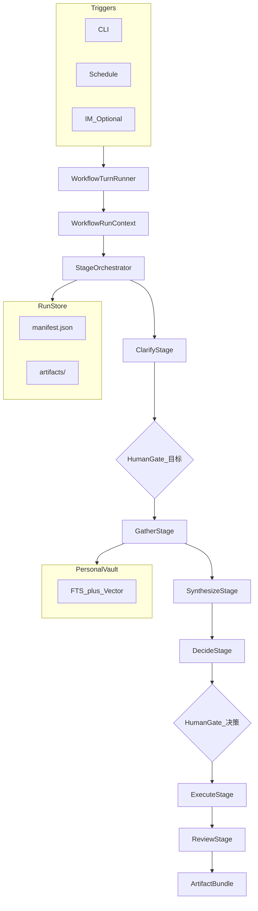

# FlowForge：个人生活生产力工作流 Agent 方案

## 1. 摘要

FlowForge 是一套**通用、可扩展的个人生活工作流 Agent 框架**。它不绑定 GitHub、企业协作或写代码场景，而是把日常生活中反复出现的一类任务——**「先想清楚 → 再查资料 → 再做决定 → 再真正去做」**——变成可恢复、可验收、可复用的自动化流水线。

市面多数 Agent 擅长聊天，但常见结果是：聊了很久，**没有清单、没有对比表、没有日程、没有可存档的决策记录**；下次遇到类似问题又要从头问一遍。FlowForge 用**阶段状态机 + 产物契约 + 个人混合记忆**解决这类问题，在 ordinary life 场景里实现**降本增效**：

- **降本**：少踩坑（消费决策）、少重复劳动（周复盘模板）、少无效 token（按需加载上下文）
- **增效**：同一类事务 30 分钟流程压缩到 10 分钟，且留下可执行的 `checklist.md` / `decision.json`

**首发垂直场景（建议 MVP 聚焦）**：**个人决策与事务闭环**——涵盖消费比价、职业/学业选择、健康管理计划、旅行方案、证件与行政事项等「需要查、需要比、需要定、需要做」的高频事务。

框架本身保持**通用**：通过 YAML 工作流模板换场景，不换内核。

---

## 2. 为什么要做「生活工作流」而不是「研发流水线」

团队协作往往依赖 GitHub、Jira、统一 CI，对个人开发者或学生是**高墙**：权限、规范、评审流程成本高。日常生活任务没有 PR，但有同样强的需求：

| 生活任务特点 | 聊天型 Agent 的不足 | FlowForge 的回应 |
|--------------|---------------------|------------------|
| 结果要能「拿来就用」 | 只有一段话 | 强制落盘 checklist、对比表、日历草稿 |
| 信息来源要可追溯 | 幻觉、无出处 | `sources.json` + Reviewer 核对 |
| 大事不能一次拍脑袋 | 缺少确认环节 | Human Gate：预算上限、方案选定 |
| 同类事会反复做 | 无记忆 | 个人 vault 混合检索 + 历史决策复用 |
| 怕花冤枉钱/浪费时间 | 无结构化比较 | DecisionFlow 标准阶段与矩阵模板 |

---

## 3. 问题陈述

### 3.1 通用 Agent 工程化痛点

| 痛点 | 表现 | 后果 |
|------|------|------|
| 多入口各一套逻辑 | CLI、IM、Web 各写一套 | 状态割裂 |
| 能力焊死在 core | 加工具要改内核 | 难扩展 |
| 检索只有一种 | 纯向量或纯关键词 | 中文笔记、账单、人名召回差 |
| 技能全文塞进 prompt | L0 过载 | token 贵、回答散 |

### 3.2 生活场景特化痛点

| 痛点 | 表现 | 后果 |
|------|------|------|
| **有回答无产出** | 「你可以考虑 A/B/C」 | 还是要自己整理 Excel |
| **调研不可复用** | 链接散落聊天里 | 三个月后忘了为啥选 B |
| **决策无约束** | 超预算、忽略禁忌 | 隐性成本高 |
| **执行断裂** | 分析完没人催 checklist | 计划搁浅 |
| **无法验收** | 不知道算「做完了」 | 心理负担一直挂着 |

FlowForge 用**产物契约**定义「什么叫做完」，用 **Reviewer** 做事实与逻辑抽检，用 **RunStore** 让下次同类任务站在上次肩膀上。

---

## 4. 与「个人 Agent 工程框架」方向的同构差异

下表为架构维度对照，不引用任何第三方申报原文。

| 维度 | 偏「对话 + 记忆」的个人框架 | FlowForge |
|------|---------------------------|-----------|
| 核心循环 | ReAct 边聊边调工具 | **工作流阶段机** Clarify→Gather→Synthesize→Decide→Execute→Review |
| 默认出口 | 回复消息 | **Artifact Bundle**（清单、矩阵、日程草稿、决策记录） |
| 记忆 | 长期聊天记忆 | **PersonalVault**：笔记/账单/历史决策，FTS + 向量混合 |
| 上下文 | 技能 L0/L1/L2 | **生活上下文 L0/L1/L2**（见 §7） |
| 入口 | CLI / Gateway / IM | CLI、本地 Web、飞书/钉钉（可选）、定时触发 |
| 质量 | trace 可观测 | **Reviewer 独立** + 预算/禁忌规则自动校验 |
| 协作 | 可选 | **默认单人本地**，无 GitHub 依赖 |

**继承的工程化思想**：统一 `run_workflow()`、插件与钩子、混合检索、渐进式注入。  
**刻意强化**：生活场景的**可执行产物**与**决策门禁**。

---

## 5. 降本增效：如何量化价值

| 机制 | 降本 | 增效 |
|------|------|------|
| DecisionFlow 对比矩阵 | 避免冲动消费、漏比关键维度 | 比价时间从数小时→结构化 20 分钟 |
| WeeklyReviewFlow | 减少「瞎忙」带来的隐性成本 | 周计划一次生成，复制粘贴即可执行 |
| ResearchFlow 摘要 + 来源 | 少重复搜索同一主题 | 调研报告可直接转发给家人/同事 |
| L0/L1/L2 按需加载 | token 费用下降 40%～70%（估） | 同等预算下模型可选用更好档位 |
| Run 复用历史决策 | 同类选择不重头分析 | 「上次换手机」矩阵一键 fork |
| Human Gate | 大额支出必须人工确认 | 避免 Agent 擅自下单/预约 |

建议在 `manifest.json` 中记录 `estimated_time_saved_minutes`、`budget_ceiling` 等字段，便于复盘 ROI。

---

## 6. 系统架构

### 6.1 分层

```
Triggers（CLI / 定时 / IM 可选）
        ↓
WorkflowTurnRunner
        ↓
StageOrchestrator
        ↓
 Clarifier → Researcher → Analyst → Reviewer → Executor → Archivist
        ↓
RunStore（manifest / artifacts / traces）
        ↓
PersonalVault（混合检索）· L0/L1/L2 · MCP（日历/搜索/飞书等）
        ↓
FlowPlugin 注册表
```

### 6.2 架构图



### 6.3 阶段 Agent 职责

| Agent | 职责 | 典型产物 |
|-------|------|----------|
| **Clarifier** | 澄清目标、约束、预算、禁忌 | `brief.md` |
| **Researcher** | 检索 vault + 联网（可选），收集来源 | `sources.json` |
| **Analyst** | 对比、打分、列 pros/cons | `comparison.md`, `decision-matrix.json` |
| **Reviewer** | 检查来源是否齐全、数字是否自洽、是否超预算 | `review-report.json` |
| **Executor** | 生成可执行清单、邮件/消息草稿、日历 ICS | `action-checklist.md`, `drafts/` |
| **Archivist** | 写入决策摘要，供下次检索 | `decision-record.md` → 同步 vault |

### 6.4 WorkflowRunContext（通用字段）

```text
run_id, trace_id, workflow, owner_id
goal_text, constraints, budget_ceiling
stage, artifact_index, gates, budget
vault_profile   # 使用的个人知识库配置
trigger         # cli | cron | feishu | ...
```

唯一入口：`run_workflow(ctx)`。

---

## 7. 生活场景 L0 / L1 / L2 上下文注入

| 层级 | 内容 | 示例 |
|------|------|------|
| **L0** | 用户画像与规范：预算习惯、禁忌、常用城市、技能目录索引 | `profile.yaml`、技能一览 |
| **L1** | 当前工作流相关技能全文 | `skills/decision/SKILL.md` |
| **L2** | 本轮选中的历史决策、账单片段、完整参考文档 | 上次「换笔记本」矩阵 |

与「一次性塞满所有技能」相比，Clarify 阶段只加载 L0，Gather 再按主题升 L1/L2，显著省 token。

---

## 8. PersonalVault 混合记忆

个人数据以 Markdown / CSV 存入本地 vault，切块索引至 SQLite：

| 通道 | 技术 | 适用 |
|------|------|------|
| 全文 | FTS5 / BM25 | 账单金额、医院名、型号、日期 |
| 语义 | sqlite-vec KNN | 「续航好的轻薄本」类模糊需求 |
| 融合 | 加权 + 可选 MMR | CJK 笔记与关键词并存 |

`vault_search(query)` 供 Researcher 调用；`/vault archive` 在 Review 结束后把 `decision-record.md` 写回索引。

---

## 9. 三条默认生活工作流

### 9.1 DecisionFlow（决策闭环）——**MVP 主推**

**适用**：买数码、选课、选型就医、租房、办证件选方案等。

| 阶段 | 强制产物 | 门禁 |
|------|----------|------|
| Clarify | `brief.md` | Human：目标与预算确认 |
| Gather | `sources.json`（含 url、摘要、可信度） | — |
| Synthesize | `comparison.md`, `decision-matrix.json` | — |
| Decide | `recommendation.md` | Human：选定方案（可否决 Agent 推荐） |
| Execute | `action-checklist.md` | — |
| Review | `review-report.json`, `decision-record.md` | 自动：来源数≥N、无超预算 |

**验收**：checklist 每条可执行；矩阵含≥3 个备选；推荐方案在 brief 约束内。

### 9.2 WeeklyReviewFlow（周复盘）

**适用**：学生/上班族每周日晚上 15 分钟复盘。

| 阶段 | 产物 |
|------|------|
| Clarify | `week-scope.md`（本周起止、重点域） |
| Gather | 从 vault 拉取本周笔记、未完成清单 |
| Synthesize | `week-summary.md` |
| Decide | `next-week-priorities.json`（Top3 + 时间块建议） |
| Execute | `action-checklist.md`，可选 `calendar-draft.ics` |
| Review | `decision-record.md` |

**增效**：减少周日焦虑式刷手机；**降本**：避免下周重复踩坑。

### 9.3 ResearchFlow（深度调研）

**适用**：旅游攻略、政策解读、健康管理资料整理。

| 阶段 | 产物 |
|------|------|
| Clarify | `research-questions.md` |
| Gather | `sources.json` |
| Synthesize | `report.md`（ Executive Summary ≤ 300 字） |
| Review | `fact-check.json` |
| Execute | `action-checklist.md` 或 `reading-list.md` |

---

## 10. 产物契约 Artifact Contract

阶段推进条件：必填产物存在 + schema 校验 + gates 满足。

```json
{
  "run_id": "550e8400-e29b-41d4-a716-446655440000",
  "workflow": "decision",
  "domain": "purchase_laptop",
  "goal_text": "8000 元内轻薄本，续航优先",
  "budget_ceiling": 8000,
  "stage": "review",
  "artifacts": [
    { "name": "brief.md", "path": "artifacts/brief.md", "required": true },
    { "name": "decision-matrix.json", "path": "artifacts/decision-matrix.json", "required": true },
    { "name": "action-checklist.md", "path": "artifacts/action-checklist.md", "required": true }
  ],
  "gates": {
    "goal_confirmed": true,
    "decision_confirmed": true,
    "review_passed": true
  },
  "roi": {
    "estimated_time_saved_minutes": 90,
    "tokens_used": 42000
  }
}
```

### decision-matrix.json 结构（节选）

```json
{
  "criteria": ["价格", "续航", "重量", "售后"],
  "options": [
    { "name": "型号 A", "scores": { "价格": 8, "续航": 9 }, "price": 7499 }
  ],
  "recommendation": "型号 A",
  "rationale": "在预算内续航最高"
}
```

---

## 11. 插件、钩子与 MCP

**FlowPlugin** 注册 tools / hooks / services，拓扑排序加载。

| 钩子 | 用途 |
|------|------|
| `before_clarify` | 注入 L0 画像 |
| `after_gather` | 去重 sources |
| `before_decide` | 校验 budget_ceiling |
| `after_review` | 归档至 vault |

**MCP 可选接入**（无则降级为纯本地）：

- 日历：导出 `calendar-draft.ics`
- 飞书/钉钉：推送 checklist（可选）
- 网页搜索：Gather 阶段（需用户授权）

工具命名：`mcp_<server>_<tool>`，与内置 `vault_search` 区分。

---

## 12. 安全、隐私与成本控制

| 策略 | 说明 |
|------|------|
| 本地优先 | vault 与 runs 默认在 `~/FlowForge/` |
| 敏感分级 | 医疗/证件类工作流可 `--offline-only` |
| 预算门禁 | `budget_ceiling` 超标则 Decide 阶段必须 Human |
| 工具白名单 | Executor 不可直接支付、下单，仅生成草稿 |
| Token 预算 | 超限则跳过 Gather 的联网，仅用 vault |
| Reviewer 独立 | Analyst 不能自评「已通过」 |

---

## 13. 技术选型（轻量可落地）

| 层次 | 建议 |
|------|------|
| 语言 | Python 3.11+ |
| 编排 | YAML 工作流 + 状态机 |
| 存储 | `runs/` + SQLite（vault 索引） |
| 检索 | FTS5 + sqlite-vec |
| LLM | 可插拔 API（OpenAI / 国产模型） |
| 入口 | CLI 优先；Gateway 可选 |
| 观测 | 本地 trace 日志，可选 OTel |

**刻意不做**：GitHub、git worktree、pytest、企业 SSO。

---

## 14. MVP 路线图（4 周）

| 周 | 交付 | 演示 |
|----|------|------|
| **W1** | `run_workflow` + DecisionFlow 骨架 + `brief.md` / `checklist.md` 落盘 | 「8000 元轻薄本」跑通 Clarify→Execute |
| **W2** | `decision-matrix.json` + Reviewer 规则 + Human Gate | 超预算推荐被拦截 |
| **W3** | PersonalVault FTS + `vault_search` + 决策归档 | 第二次同类任务引用上次矩阵 |
| **W4** | WeeklyReviewFlow 模板 + CLI `flowforge run weekly` | 周日晚 15 分钟端到端 |

**演示成果**：`runs/<id>/` 完整目录 + 一份可打印的 `comparison.md` + `action-checklist.md`。

---

## 15. 创新点总结

1. **生活事务阶段机**：把「想清楚→查→比→定→做→存档」标准化，而非 endless chat。  
2. **产物契约**：用文件验收「做完了」，缓解决策悬而未决。  
3. **决策矩阵与 ROI 字段**：直接服务降本增效叙事。  
4. **PersonalVault 混合检索**：服务中文个人笔记与账单场景。  
5. **通用模板 + 垂直首发**：框架可扩展，MVP 聚焦决策闭环。  
6. **无 GitHub 墙**：单人本地即可闭环，协作可选。

---

## 16. 附录

- DecisionFlow 配置：[`workflows/decision.yaml`](workflows/decision.yaml)  
- WeeklyReviewFlow 配置：[`workflows/weekly-review.yaml`](workflows/weekly-review.yaml)  
- 已废弃研发向示例：~~`workflows/feature.yaml`~~（由生活向模板替代）

---

*文档版本：2.0 · 场景：个人生活生产力（通用框架 + 决策闭环首发）· 代号：FlowForge*
