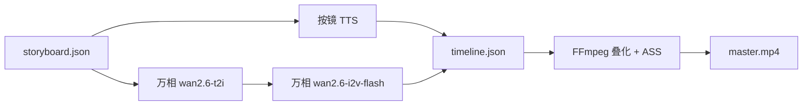

# 微电影 Agent 规划方案

> 基于 `flow-agent` 现有框架，面向「用户输入模糊剧情 → 动画 + 字幕 + 配音一键成片」的产品规划。  
> 目标：**画面连贯、节奏自然**，避免「静图轮播 + 硬切拼接」的廉价感。  
> **视频默认供应商：阿里云百炼 · 万相图生视频**（与万相出图、Qwen 分镜 **同一 API Key**）。  
> 文档版本：1.1 · 2026-05-26

---

## 1. 项目现状速览

### 1.1 定位与技术栈

| 维度 | 现状 |
|------|------|
| **产品** | 连载爽文 → 分镜 → 竖屏短剧（~90s/集）→ 发布包；扩展为 **微电影一键成片** |
| **语言** | Go 1.25 + Cobra CLI |
| **编排** | YAML 工作流 + 线性阶段机（非 LLM Tool Loop） |
| **内容模型** | DeepSeek（规划/写作/合规）+ 百炼 Qwen（连续性/分镜） |
| **媒体（微电影目标栈）** | 火山/百炼 TTS + **万相 t2i 关键帧** + **万相 i2v 动效** + FFmpeg 合成 |
| **媒体（短剧现网栈）** | 同上出图；视频仍为可灵 i2v（`video-native-short`），微电影将切换为万相 |
| **记忆** | SeriesVault（SQLite FTS、角色状态、上集指标回流） |

### 1.2 已有流水线（可直接复用）

```text
plan → write → continuity → storyboard → produce → comply → publish → learn
         ↑ 连载小说真源              ↑ 分镜 JSON          ↑ TTS + 图 + 视频 + ASS + master.mp4
```

**与「一键微电影」高度相关的已实现能力：**

| 能力 | 实现位置 | 说明 |
|------|----------|------|
| 分镜契约 | `pkg/artifacts/storyboard.go` | 每镜 `visual_prompt`、`narration`、时长策略 |
| 按镜 TTS + 时间轴 | `produce_media.go`、`timeline.go` | 以实测音频驱动每镜时长 |
| 全量 ASS 字幕 | `internal/compose/subtitles/ass.go` | 按旁白分段烧录 |
| 音画同步门禁 | `gates.go` → `av_sync_ok` | `max_drift_sec ≤ 0.5` |
| 全镜 AI 动效（现网） | `video-native-short` | 万相 t2i → **可灵** i2v（待微电影改为万相 i2v） |
| 镜头叠化 | `ffmpeg.go` `clip_crossfade_sec` | 默认 0.35s 叠化 |
| 断点续跑 | `flowagent resume --from-stage` | 分镜/合成可单独重跑 |
| 成本账本 | `cost-ledger.json`、`flowagent cost` | 按 token/字符/秒记账 |
| 视频 Provider 接口 | `internal/provider/video/client.go` | `ImageToVideo` / `TextToVideo`，**待接 `wan.go`** |

### 1.3 与微电影需求的差距

| 用户需求 | 当前默认路径 | 差距 |
|----------|--------------|------|
| **模糊剧情输入** | 需 `series` + `episode`，走 Plan/Write | 缺少 Expand + Script 轻量入口 |
| **一键成片** | 8 阶段 + 人工门禁 | 需 `micro-movie` 工作流 + 默认 `--auto-gate` |
| **流畅清晰** | crossfade + 全镜 mp4，跨镜一致性弱 | 定妆 + 万相同链路关键帧 |
| **测试期低成本** | 可灵 ~¥0.28/s，单条视频费高 | **改万相 i2v-flash ~¥0.1/s**，同一 Key |
| **非单纯拼接** | FFmpeg 串接 + 叠化 | 场景 BGM、可选调色（P2） |
| **更长片长** | ~90s | 3～8 分钟，镜数与秒数线性增费 |
| **万相视频未接入代码** | 仅 `kling.go` 已实现 | **P0：`provider/video/wan.go` + `bundle` 路由** |

**结论：** 内核不改；微电影 = 新工作流 + 新 Stack（**百炼万相全链路**）+ 万相视频 Provider 实现。

---

## 2. 产品定义：微电影 Agent

### 2.1 用户故事

> 用户输入：「一个程序员深夜加班，突然发现显示器里伸出一只手」  
> 系统输出：3～5 分钟竖屏/横屏微电影，`master.mp4` + 字幕 + 可选发布包。

### 2.2 成功标准（可验收）

| 指标 | 目标 |
|------|------|
| 端到端耗时 | MVP：15～40 分钟（万相队列通常短于可灵重度排队） |
| 音画漂移 | `sync-report` 最大漂移 ≤ 0.5s |
| 镜头衔接 | 默认叠化/转场，可配置禁止硬切 |
| 动效占比 | 默认 ≥ 80% 镜头为万相 i2v mp4 |
| 字幕覆盖 | 旁白全文 ASS |
| 单条成本 | **测试档** 3 分钟 ≤ **¥45**；标准画质 ≤ **¥70**（见 §4，以百炼账单为准） |
| API 配置 | **仅需百炼 Key + 火山 TTS（可选）**，测试期可不配可灵 |

### 2.3 与现有「爽文短剧」的差异

| 维度 | novel-short-douyin | micro-movie（建议） |
|------|--------------------|---------------------|
| 输入 | 系列 + 集号 | 模糊剧情 / `--plot` |
| 上游 | Plan + Write + Continuity | **Expand** + **Script** |
| 时长 | ~90s | 180～480s |
| 视频 | 可灵 i2v（现网 stack） | **万相 i2v**（微电影 stack） |
| 记忆 | SeriesVault 强依赖 | 单集可跳过 vault |
| 门禁 | 人工为主 | 默认自动 |

---

## 3. 百炼万相视频技术方案（默认）

### 3.1 为何选万相（相对可灵）

| 维度 | 百炼万相 i2v | 可灵 i2v（现网） |
|------|--------------|------------------|
| **账号** | 与 t2i、Qwen **同一 `dashscope` Key** | 单独 AK/SK |
| **测试单价** | `wan2.6-i2v-flash` 约 **¥0.1/秒** | 约 **¥0.28～0.43/秒** |
| **质量档** | `wan2.6-i2v` 720P 约 **¥0.6/秒** | Pro 档更贵 |
| **免费额度** | 新用户约 **50 秒** 图生视频（90 天内，以控制台为准） | 视活动 |
| **链路** | t2i 关键帧 → i2v **同生态**，prompt/地域一致 | 已接入，作精品回退 |
| **单镜时长** | 2～15 秒 | 通常 5/10 秒 |

官方文档：[视频生成与编辑模型（百炼）](https://www.alibabacloud.com/help/zh/model-studio/video-generate-edit-model)

### 3.2 模型选型（微电影 Stack 约定）

| 用途 | 模型 ID | 何时用 |
|------|---------|--------|
| 关键帧文生图 | `wan2.6-t2i` | 每镜首帧（已有 `image/dashscope.go`） |
| **图生视频 · 测试/默认** | **`wan2.6-i2v-flash`** | 全镜动效、micro-movie-standard / test |
| 图生视频 · 质量 | `wan2.6-i2v` | 720P/1080P，精品档或关键镜 |
| 文生视频（回退） | `wan2.6-t2v` 或 flash 系列 | 无图时极少使用；优先 i2v |
| 可选精品点缀 | 可灵 `image2video` | 仅方案 C 或单镜 `hero_shot` |

**勿在省钱档误开 `wan2.6-i2v` 标准版**：1080P 约 ¥1/秒，比可灵更贵。

### 3.3 媒体管线（万相版）



与现网 `producer_video.go` 流程一致，仅 `Bundle.Video` 从 `Kling` 换为 `Wan`。

### 3.4 推荐架构（业务阶段）


工作流示意：

```yaml
name: micro-movie
context:
  stack_profile: micro-movie-wan-flash   # 默认测试栈，见 §4
  target_duration_sec: 180
stages:
  - id: expand
  - id: script
  - id: storyboard
  - id: produce
  - id: comply
  - id: publish
```

### 3.5 产物契约扩展

| 文件 | 用途 |
|------|------|
| `artifacts/plot-input.md` | 用户原始输入 |
| `artifacts/story-spine.json` | logline、三幕、情绪曲线 |
| `artifacts/script.json` | 场景、对白、动作线 |
| `artifacts/character-sheets.json` | 定妆描述（写入每镜 `visual_prompt` 前缀） |
| `artifacts/storyboard.json` | 沿用 + `scene_id`、`transition` |
| `artifacts/timeline.json` | 音频轴 + 字幕事件 |
| `artifacts/master.mp4` | 成片 |

### 3.6 「流畅非拼接」手段

| 手段 | 成本 | 状态 |
|------|------|------|
| 音频驱动时间轴 | 低 | ✅ 已有 |
| 镜头叠化 | 低 | ✅ 已有 |
| **万相 i2v 全镜** | **低～中** | 🔲 接 `wan.go` 后可用 |
| 角色定妆 prompt | 低 | Phase 2 |
| 同场景复用关键帧 URL | 低 | Phase 2 |
| BGM | 低 | Phase 2 |
| Ken Burns 仅转场镜 | 极低 | 经济档 A |
| 可灵点缀镜 | 高 | 精品档 C 可选 |

---

## 4. 三档性价比方案（万相定价）

> 视频秒价以百炼控制台为准；下表按 **flash ¥0.1/s**、**标准 i2v 720P ¥0.6/s**、**t2i ¥0.2/张** 估算。新用户先消耗 **50 秒** 免费视频额度做联调。

### 4.1 方案对比总表

| 档位 | Stack 名 | 时长 | 视觉策略 | 3 分钟视频费粗算 | 整片粗算 | 场景 |
|------|----------|------|----------|------------------|----------|------|
| **A** | `micro-movie-economy` | 2～3 min | 30% 万相 flash 关键镜 + Ken Burns | ~¥5～9 | **¥20～35** | 极限省钱、管线调试 |
| **B** | `micro-movie-wan-flash` ⭐ | 3～5 min | **100% wan2.6-i2v-flash** | ~¥18（180s） | **¥35～55** | **默认测试 + MVP** |
| **C** | `micro-movie-wan-hd` | 5～8 min | flash 主镜 + **wan2.6-i2v** 高潮镜 / 可选可灵点缀 | ~¥25～60 | **¥70～120** | 质量优先 |

对比原可灵方案 B（~¥70～95 / 3min）：**万相 flash 约省 40%～50% 视频费**，且少维护一套 Key。

### 4.2 方案 A：经济档

- 16～24 镜，**6～8 镜** `ai_video_budget` → 万相 flash i2v，其余 Ken Burns + 强叠化。
- 不配可灵亦可跑通。
- `video.enabled: true`，`max_clips` / 分镜策略限制 i2v 镜数。

### 4.3 方案 B：标准档（默认）⭐

**文件：** `config/stacks/micro-movie-wan-flash.yaml`

```yaml
name: micro-movie-wan-flash
version: "1.0"
description: 微电影默认 — 万相 t2i + wan2.6-i2v-flash，单百炼 Key

target_duration_sec: 240
cost_budget_cny: 55

llm:
  planner:    { provider: deepseek, model: deepseek-chat }
  writer:     { provider: deepseek, model: deepseek-chat }
  continuity: { provider: bailian, model: qwen-plus }
  storyboard: { provider: bailian, model: qwen-plus }

tts:
  provider: volcengine
  product: doubao-speech-2.0-emotion

image:
  provider: bailian
  model: wan2.6-t2i
  aspect_ratio: "9:16"
  resolution: "1080x1920"

video:
  enabled: true
  provider: bailian          # 新增：路由到 wan.go（非 kling）
  strategy: image2video
  model: wan2.6-i2v-flash
  quality_model: wan2.6-i2v  # 可选：门禁失败时升级单镜
  all_shots: true
  require_video: true
  video_native_only: true
  clip_duration_sec: 5
  resolution: "720P"           # flash 测试期优先 720P 省额度
  motion_prompt_suffix: "，竖屏9:16，镜头缓慢推进，人物有自然动作与表情，禁止静态海报"

compose:
  engine: ffmpeg
  video_native_only: true
  clip_crossfade_sec: 0.4
  subtitle_format: ass
  bgm_enabled: true

unit_prices_cny:
  llm_input_per_1k_tokens: 0.0014
  llm_output_per_1k_tokens: 0.0028
  tts_per_1k_chars: 0.12
  image_per_shot: 0.20          # 对齐万相 t2i 官方价
  video_per_second: 0.10        # wan2.6-i2v-flash

cost_targets_cny:
  llm: [6, 12]
  tts: [4, 8]
  image: [6, 10]
  video: [12, 22]
  total: [35, 55]
```

**3 分钟 / 36 镜 × 5s 成本粗算：**

| 项 | 估算 |
|----|------|
| LLM（扩写 + 剧本 + 分镜） | ¥8～12 |
| TTS（~800 字） | ¥5～8 |
| 万相 t2i × 36 | ¥7～8 |
| 万相 i2v-flash × 180s | ¥18 |
| **合计** | **¥38～46**（不含免费额度） |

### 4.4 方案 C：精品档

**文件：** `config/stacks/micro-movie-wan-hd.yaml`

- 镜数 18～24（少而长），单镜 8～10s（万相最长 15s）。
- 主路径 `wan2.6-i2v` 720P；可选 2～4 镜 `video.fallback_provider: kling`（需单独 Key）。
- 场景板 + 调色 + BGM ducking。

---

## 5. 供应商策略

### 5.1 默认与回退

```text
主路径：百炼 Key
  ├─ Qwen      → 分镜 / 连续性
  ├─ wan2.6-t2i → 关键帧
  └─ wan2.6-i2v-flash → 动效（微电影默认）

回退（可选）：
  ├─ wan2.6-i2v（单镜升级画质）
  ├─ Ken Burns（经济档非动效镜）
  └─ 可灵 i2v（精品点缀，非必需）
```

### 5.2 LLM / TTS / 字幕

| 项 | 推荐 |
|----|------|
| 扩写 / 剧本 | deepseek-chat |
| 分镜 | qwen-plus + JSON 校验 |
| TTS | 火山豆包（现网）或百炼 CosyVoice（同 Key 时可统一） |
| 字幕 | ASS，无额外 API |

### 5.3 降本技巧（测试期）

1. **`--dry-run`**：零媒体费，调工作流与分镜。
2. **先跑方案 A**，再切 `micro-movie-wan-flash` 全镜。
3. **消耗百炼 50 秒免费视频额度** 做 `config test-wan-video`。
4. **720P flash** 联调，成片满意再开 1080P / `wan2.6-i2v`。
5. **镜数合并**：`ceil(目标秒数 / 5)`，避免空镜。
6. **prompt 缓存**：同 hash 跳过重复 i2v（Phase 2）。

### 5.4 口型与电影感（非 MVP）

对口型、数字人：HeyGen / LivePortrait 等，Phase 3；与万相 i2v 正交。

---

## 6. 实施路线图

### Phase 0：验证基线（1～2 天）

- [x] `flowagent config check` 确认 **百炼 Key** 已填
- [x] 干跑：`flowagent run micro-movie --plot "..." --dry-run --auto-gate`
- [x] 单镜：`flowagent test-shot` / `flowagent config test-wan-video`

### Phase 1：万相视频 + 微电影 MVP — **已实现**

| 任务 | 状态 |
|------|------|
| **`internal/provider/video/wan.go`** | ✅ |
| **`internal/provider/bundle.go`** | ✅ `provider: bailian` → Wan |
| **`internal/config/stack_media.go`** | ✅ resolution / quality_model / silent_audio |
| **`config/stacks/micro-movie-wan-flash.yaml`** | ✅ |
| **`docs/workflows/micro-movie.yaml`** | ✅ |
| `RunPlotExpander` / `RunScreenwriter` | ✅ |
| CLI `--plot` / `--plot-file` | ✅ |
| `flowagent test-shot` | ✅ 单镜测试 |
| `StoryboardPolicy` `MicroMoviePolicy()` | ✅ |

**交付物：** 一句话剧情 → 3 分钟 `master.mp4`（**万相 flash 全镜** + ASS + TTS），**无需可灵 Key**。

### Phase 2：体验与质量（2～3 周）

| 任务 | 说明 |
|------|------|
| `character-sheets.json` + prompt 注入 | 减变脸 |
| Produce `errgroup` 并行 t2i / i2v / TTS | 缩短墙钟时间 |
| `micro-movie-economy` | 混合 Ken Burns |
| `micro-movie-wan-hd` | 标准 i2v + 可选可灵点缀 |
| BGM、色调归一 | compose 增强 |
| i2v 结果缓存 | 降重复费 |

### Phase 3：产品化（按需）

Web 预览、多角色 TTS、横屏发布包、对口型 stage。

---

## 7. 关键代码扩展点

| 扩展点 | 路径 | 动作 |
|--------|------|------|
| **万相视频** | `internal/provider/video/wan.go` | **新建**，对接百炼异步任务 API |
| Bundle 路由 | `internal/provider/bundle.go` | `bailian` / `dashscope` → `NewWan` |
| Stack 解析 | `internal/config/stack_media.go` | `resolution`、`quality_model` |
| 工作流 | `docs/workflows/micro-movie.yaml` | 新建 |
| Stack | `config/stacks/micro-movie-wan-*.yaml` | 新建三档 |
| 阶段 | `internal/stage/stage.go` | expand, script |
| Agent | `internal/agent/plot_expander.go`, `screenwriter.go` | 新建 |
| Produce | `producer_video.go`, `produce_media.go` | 万相路径、并行 |
| 分镜 | `prompts/storyboard.go` | `StoryboardSystemMicroMovie`（万相运镜描述） |
| CLI | `cmd/flowagent/cmd/run.go`, `config.go` | `--plot`、`test-wan-video` |
| 测试 | `scripts/accept-micro-movie.ps1` | dry-run + wan 冒烟 |
| 可灵 | `video/kling.go` | **保留**，仅精品栈 / 回退 |

### 7.1 `wan.go` 实现要点（规划）

- 认证：复用 `config.Providers.DashScope`（与 `image/dashscope.go` 相同 `api_key`、`region`、`base_url`）。
- 流程：**创建任务** → 轮询 `task_status` → 下载 `video_url` 到 `artifacts/assets/{shot_id}.mp4`。
- 入参：首帧图（本地路径 → OSS URL 或 Base64，按百炼文档）、`prompt`、`duration`（2～15）、`resolution`（720P/1080P）。
- 模型：默认 `wan2.6-i2v-flash`；stack 可覆盖。
- 错误：失败不计费（百炼规则）；重试与 429 退避对齐 `llm_retry` 风格。

---

## 8. 风险与预期管理

| 风险 | 缓解 |
|------|------|
| 万相 flash 动感弱于可灵 Pro | 测试期可接受；精品镜用 `wan2.6-i2v` 或可灵点缀 |
| 跨镜人物不一致 | 定妆 prompt + 同场景复用关键帧 |
| 口型与旁白不对齐 | 解说体剧本，不对口型 |
| 标准 i2v 误开导致超支 | Stack 默认 flash；`cost_budget_cny` 门禁 |
| 百炼地域与 Key 不匹配 | `dashscope.region` + `config test-api` |
| 接口未实现导致 Produce 失败 | Phase 1 先合 `wan.go` 再开工作流 |

---

## 9. 决策建议（一句话）

**微电影 Agent 默认走「百炼一条 Key」：万相 t2i 关键帧 + `wan2.6-i2v-flash` 全镜动效 + 音频轴时间轴 + ASS + 叠化；测试用 `micro-movie-wan-flash`（约 ¥35～55/3 分钟），省钱用经济混合档，提质用 `wan2.6-i2v` 或可灵点缀。可灵保留为现网短剧栈与精品回退，非微电影必需。**

优先投入顺序：**`wan.go` 接入 → micro-movie 工作流 → 剧本/分镜质量 → 并行 Produce → 定妆与缓存**。

---

## 10. 附录

### 10.1 相关文档

| 文档 | 关系 |
|------|------|
| [NOVEL_STREAM_VIDEO_PUBLISH_PROPOSAL.md](./NOVEL_STREAM_VIDEO_PUBLISH_PROPOSAL.md) | 母产品架构 |
| [VIDEO_NATIVE_SHORT.md](./VIDEO_NATIVE_SHORT.md) | 现网可灵短剧栈（微电影不默认使用） |
| [PROVIDER_ALTERNATIVES.md](./PROVIDER_ALTERNATIVES.md) | 供应商替换（待补充万相 i2v 为默认） |
| [API_KEYS_SETUP.md](./API_KEYS_SETUP.md) | 百炼 Key 配置 |
| [百炼 · 视频生成模型](https://www.alibabacloud.com/help/zh/model-studio/video-generate-edit-model) | 万相 i2v 官方说明 |

### 10.2 与现网短剧栈的关系

| 工作流 | 推荐 stack | 视频 |
|--------|------------|------|
| `novel-short-douyin` | `video-native-short` | 可灵（已实现） |
| `micro-movie` | `micro-movie-wan-flash` | **万相（待实现）** |

两套 stack 可并存，通过 `stack_profile` 切换，无需拆除可灵代码。

### 10.3 快速命令预览

```powershell
go build -o bin\flowagent.exe .\cmd\flowagent

# 配置：仅需百炼 Key（与现网万相出图相同）
.\bin\flowagent.exe config check
.\bin\flowagent.exe config test-wan-video    # Phase 1 完成后

# 干跑
.\bin\flowagent.exe run micro-movie --plot "程序员深夜加班，显示器伸出一只手" --dry-run --auto-gate -v

# 万相 flash 全镜（默认）
.\bin\flowagent.exe run micro-movie --plot-file .\my-plot.md --stack micro-movie-wan-flash --auto-gate -v

# 从分镜重跑
.\bin\flowagent.exe resume --run-id <uuid> --from-stage storyboard --stack micro-movie-wan-flash --auto-gate -v
```

---

*文档版本 1.1：视频默认供应商由可灵调整为百炼万相；实现以 `wan.go` 与 `micro-movie-wan-flash.yaml` 落地为准。*
