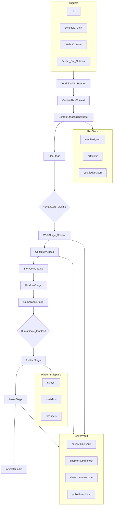

# FlowAgent：流式小说生成 × 短视频生产 × 多平台发布 工作流方案

## 1. 摘要

**FlowAgent（内容生产向）** 是在 `flow-agent` 仓库通用工作流内核之上，面向 **网文/短篇连载 → 分镜脚本 → 音视频合成 → 抖音/快手/视频号等平台发布** 的全链路 Agent 编排方案。

目标不是做一个「会写小说的聊天机器人」，而是把内容创业团队反复踩坑的整条产线——**设定一致、连载不断更、画面可量产、平台规则可过审、数据可复盘**——变成 **可恢复、可验收、可复用** 的自动化流水线。

对标痛点来自两类系统：

| 来源 | 典型问题 |
|------|----------|
| **通用项目型 Agent**（研发/协作向） | 多入口状态割裂、能力焊死内核、上下文爆炸、无产物验收、无法断点续跑 |
| **内容型单点工具**（写作/剪映/发布各一套） | 人设漂移、章节断层、音画不同步、标题标签靠手感、违规下架无归因 |

FlowAgent 用 **阶段状态机 + 产物契约 + 连载记忆库（SeriesVault）+ 平台适配层** 统一解决，在 MCN/个人创作者场景实现 **降本增效**：

- **降本**：减少返工（人设崩、镜头废片）、减少无效 token（按需加载世界观/前情）、减少违规下架损失
- **增效**：日更/周更稳定产出、同一 IP 多平台一键改编、发布数据回流驱动下一章钩子

**首发垂直场景（MVP）**：**短篇爽文连载 + 竖屏解说视频 + 抖音草稿发布**（可人工终审后点击发布）。

**框架保持通用**：换 YAML 工作流即可扩展成长篇、有声书、图文笔记、B 站横屏等形态，不换编排内核。

**个人开发者默认技术栈**：见 **§9 标准档推荐 AI 搭配**（DeepSeek + Qwen + 火山 TTS + 万相/即梦 + 可灵点睛，单条 3 分钟约 ¥30～60）。

**实现语言**：**Go 1.22+**（编排内核、CLI、Provider 插件）；详见 **§8** 与 [`GO_IMPLEMENTATION.md`](GO_IMPLEMENTATION.md)。

---

## 2. 问题陈述：内容生产 Agent 的核心痛点

### 2.1 继承自「项目型 Agent」的工程化痛点

| 痛点 | 在内容流水线中的表现 | 后果 |
|------|----------------------|------|
| 多入口各一套逻辑 | 写作在 Web、分镜在表格、剪辑在剪映、发布在手机 | 版本对不上，不知道「当前真源」是哪一版 |
| 能力焊死在 core | 加一个 TTS/换一家图生视频就要改内核 | 模型迭代快，系统跟不上 |
| 检索只有一种 | 纯向量记不住「第 37 章男主受伤」这类精确事实 | 人设、伏笔、数值设定前后矛盾 |
| 技能/设定全文塞进 prompt | 整本书大纲 + 全部人设每次生成 | token 暴涨，质量反而下降 |
| 无产物契约 | 聊出 5000 字但没有 `chapter.md` / `storyboard.json` | 无法对接剪辑、无法验收「本章完成」 |
| 无断点续跑 | 生成到一半 API 超时 | 从头发，浪费已消耗的算力与创意 |
| 无独立 Reviewer | 写手模型自评「没问题」 | 敏感词、平台违禁、逻辑硬伤流到发布环节 |

### 2.2 流式小说 + 视频发布特化痛点

| 痛点 | 表现 | 后果 |
|------|------|------|
| **人设/世界观漂移** | 每章重新 prompt，无结构化 bible | 读者跳戏、评论骂「换作者了」 |
| **连载连续性断裂** | 不记得上章 cliffhanger、伏笔未回收 | 追更流失 |
| **流式生成不可控** | 一口气生成过长、中途跑偏难截断 | 废稿率高、难以及时改钩子 |
| **文本≠可拍画面** | 大段心理描写无法可视化 | 分镜师/剪辑大量返工 |
| **音画节奏不匹配** | 旁白 45 秒画面只有 20 秒素材 | 观感廉价、完播率低 |
| **平台规则各异** | 抖音时长、字幕安全区、话题格式不同 | 过审失败、限流、账号风险 |
| **发布无闭环** | 发了就忘，不看完播/互动 | 下一章选题靠猜 |
| **版权与合规** | 真人脸、商标、违禁词 | 下架、封号 |
| **成本不可见** | LLM + 图生视频 + TTS 费用分散 | 单条视频 ROI 算不清 |

FlowAgent 的回应：**用文件与 schema 定义「本章做完」**，用 **ContinuityKeeper** 维护连载真源，用 **StreamSupervisor** 控制流式切片，用 **PlatformAdapter** 隔离各平台规则，用 **PublishArchivist** 把数据写回 SeriesVault 供下一章使用。

---

## 3. 系统定位：与 FlowForge 内核的关系

本方案 **复用** 仓库已有 FlowForge 思想（见 [`FLOW_AGENT_PROPOSAL.md`](FLOW_AGENT_PROPOSAL.md)），**替换领域层**：

| 维度 | FlowForge（生活向） | FlowAgent（内容向） |
|------|---------------------|---------------------|
| 核心循环 | Clarify→Gather→Synthesize→Decide→Execute→Review | **Plan→Write→Visualize→Produce→Comply→Publish→Learn** |
| 记忆库 | PersonalVault（笔记/账单） | **SeriesVault**（设定 bible、章节摘要、角色状态、发布数据） |
| 默认出口 | checklist、决策矩阵 | **chapter.md、storyboard.json、master.mp4、publish-pack.json** |
| 人机门禁 | 预算/方案确认 | **大纲确认、成片终审、发布授权** |
| 外部集成 | 日历、飞书 | **TTS、图/视频生成、剪映 API、抖音开放平台** |

**同构优势**：团队已熟悉的 `run_workflow()`、YAML 阶段、插件钩子、混合检索、L0/L1/L2 上下文策略可直接迁移，降低从零造轮子的成本。

---

## 4. 系统架构

### 4.1 分层总览

```
Triggers（CLI / 定时日更 / Web 控制台 / 飞书机器人）
        ↓
WorkflowTurnRunner（统一 run_id、trace、预算）
        ↓
ContentStageOrchestrator
        ↓
 Planner → Writer → ContinuityKeeper → Storyboarder
        → Producer → Compliance → Publisher → Analyst
        ↓
RunStore（manifest / artifacts / traces / cost ledger）
        ↓
SeriesVault（FTS + 向量 + 结构化状态表）
        ↓
ModelRouter（LLM / 图像 / 视频 / TTS 可插拔）
        ↓
PlatformAdapter（抖音 / 快手 / 视频号 / B站…）
        ↓
ContentPlugin 注册表（钩子、工具、降级策略）
```

### 4.2 架构图



### 4.3 阶段 Agent 职责

| Agent | 职责 | 典型产物 |
|-------|------|----------|
| **Planner** | 根据系列 bible、上章摘要、发布数据定本章目标、钩子、字数/时长预算 | `episode-brief.md`, `hook-plan.json` |
| **Writer** | **流式**生成本章正文，按 chunk 落盘，支持中途改纲 | `chapter.md`（分片 `chapter.parts/`） |
| **ContinuityKeeper** | 对照 bible/角色状态做一致性校验，输出修订指令 | `continuity-report.json`, `character-state.patch.json` |
| **Storyboarder** | 将可拍段落转为镜头清单（景别、时长、旁白、画面提示） | `storyboard.json`, `narration.ssml` |
| **Producer** | 调度 TTS、配图/图生视频、字幕、合成时间轴 | `timeline.json`, `assets/`, `master.mp4` |
| **Compliance** | 敏感词、平台违禁、版权风险提示 | `compliance-report.json` |
| **Publisher** | 生成标题/描述/话题/封面，调用平台 API 或导出发布包 | `publish-pack.json`, `platform-draft-ids.json` |
| **Analyst** | 拉取播放/互动数据，写回 vault，生成下章建议 | `metrics-snapshot.json`, `next-episode-hints.md` |

### 4.4 ContentRunContext（关键字段）

```text
run_id, trace_id, workflow, series_id, episode_no
goal_text, tone, genre_tags, target_duration_sec
stage, artifact_index, gates, token_budget, cost_budget_cny
vault_profile          # 系列知识库配置
stream_config          # chunk_size, max_tokens_per_chunk, stop_sequences
platform_targets[]     # douyin | kuaishou | ...
publish_mode           # draft | schedule | live_review
continuity_strictness  # strict | relaxed
```

唯一入口：`run_workflow(ctx)` —— 与 FlowForge 保持一致，便于共用 Runner 与观测。

---

## 5. 核心机制设计

### 5.1 流式写作：StreamSupervisor

聊天式一次性生成整章不可控。FlowAgent 采用 **「规划 → 分块流式 → 块级验收 → 合并」**：

```
Planner 输出 scene_list[1..N]
  for each scene:
    Writer.stream(scene_prompt) → chunk 落盘
    on_chunk: ContinuityKeeper.light_check(可选)
    on_scene_end: 强制写入 scene_summary → SeriesVault
  merge → chapter.md
  ContinuityKeeper.full_check → 不通过则回写 Writer 仅改问题段落
```

| 参数 | 建议默认 | 说明 |
|------|----------|------|
| `chunk_max_tokens` | 400～800 | 控制单次跑偏半径 |
| `scene_max_chars` | 800～1500 | 适配 60～90 秒旁白 |
| `stop_on_gate_fail` | true | 一致性不通过不进入分镜 |

**优势**：API 中断可从 `chapter.parts/scene-03.part` 续跑；编辑可只改单场景不重写全书。

### 5.2 连载记忆：SeriesVault

| 存储 | 内容 | 检索方式 |
|------|------|----------|
| `series-bible.yaml` | 世界观、人设、禁忌、文风 | L0 常驻摘要 |
| `character-state.json` | 角色当前位置、关系、持有物 | 结构化精确读 |
| `chapter-summaries/` | 每章 200 字摘要 + 伏笔表 | FTS + 向量 |
| `foreshadow-registry.json` | 未回收伏笔 | Planner 强制引用 |
| `publish-metrics/` | 各平台播放、完播、评论关键词 | Analyst 回流 |

**L0 / L1 / L2 注入策略**（沿用 FlowForge）：

| 层级 | 内容 | 何时加载 |
|------|------|----------|
| L0 | 系列一句话梗概 + 人设表 + 风格禁令 | 每章开始 |
| L1 | 本章 brief + 上 1～3 章摘要 | Write 阶段 |
| L2 | 相关伏笔全文、类似高分章节片段 | Continuity 失败或 Planner 点名时 |

### 5.3 从文本到视频：可拍性契约

`storyboard.json` schema 强制字段示例：

```json
{
  "episode_no": 12,
  "target_duration_sec": 75,
  "shots": [
    {
      "id": "s01",
      "duration_sec": 4.5,
      "visual_type": "ai_image | ken_burns | ai_video | text_card | b_roll",
      "ai_video_budget": false,
      "visual_prompt": "都市夜景，女主背影，霓虹",
      "narration": "她没想到，分手电话会在雨夜响起。",
      "subtitle": "分手电话在雨夜响起",
      "sfx": "rain_light"
    }
  ],
  "total_narration_sec": 72.3
}
```

**门禁**：`|sum(duration_sec) - target_duration_sec| ≤ 3` 且 `narration_sec` 与 TTS 实测误差 ≤ 5%。

### 5.4 平台适配：PlatformAdapter

每个平台一个插件，实现统一接口：

```text
validate(publish-pack) → compliance hints
transform(video, metadata) → 分辨率、码率、安全区
publish(draft | schedule) → platform id
fetch_metrics(since) → 标准化 metrics 写入 vault
```

| 平台 | MVP 策略 | 说明 |
|------|----------|------|
| 抖音 | 开放平台草稿 + 人工发布 | 审核与资质门槛高，先半自动 |
| 快手 / 视频号 | 发布包导出 + 手动上传 | 降低 API 耦合 |
| 后续 | 全自动 schedule | 资质齐全后开启 |

### 5.5 产物契约（Artifact Contract）

阶段推进条件：**必填产物存在 + JSON schema 校验 + gates 满足**。

```json
{
  "run_id": "7c9e6679-7425-40de-944b-e07fc1f90ae7",
  "workflow": "novel-short-douyin",
  "series_id": "ceo-rebirth-001",
  "episode_no": 12,
  "stage": "learn",
  "artifacts": [
    { "name": "chapter.md", "required": true },
    { "name": "storyboard.json", "required": true },
    { "name": "master.mp4", "required": true },
    { "name": "publish-pack.json", "required": true },
    { "name": "compliance-report.json", "required": true }
  ],
  "gates": {
    "outline_confirmed": true,
    "continuity_passed": true,
    "final_cut_approved": true,
    "publish_authorized": true
  },
  "cost": {
    "llm_cny": 2.4,
    "tts_cny": 0.8,
    "video_gen_cny": 6.0,
    "total_cny": 9.2
  },
  "roi": {
    "views_24h": 12000,
    "completion_rate": 0.38,
    "cost_per_1k_views_cny": 0.77
  }
}
```

---

## 6. 默认工作流：NovelShortDouyinFlow

**适用**：爽文短篇、解说类竖屏、日更 1～3 分钟剧集。

| 阶段 | 强制产物 | 门禁 |
|------|----------|------|
| Plan | `episode-brief.md`, `hook-plan.json` | Human：确认钩子与禁忌 |
| Write（流式） | `chapter.md`, `chapter.parts/` | 自动：字数/时长区间 |
| Continuity | `continuity-report.json` | 自动：无 critical；否则回退 Write |
| Storyboard | `storyboard.json`, `narration.ssml` | 自动：时长误差门禁 |
| Produce | `timeline.json`, `master.mp4` | 自动：分辨率/码率 |
| Comply | `compliance-report.json` | 自动：无 block 级违规 |
| Publish | `publish-pack.json` | Human：成片终审；授权发布 |
| Learn | `metrics-snapshot.json`, `next-episode-hints.md` | — |

**验收标准（Definition of Done）**：

1. `chapter.md` 与 `storyboard.json` 旁白文本一致（diff 阈值 0）。
2. `master.mp4` 满足抖音竖屏 9:16，字幕在安全区内。
3. `publish-pack.json` 含标题、描述、5～10 个话题标签、封面帧路径。
4. `cost.total_cny` 记入 ledger，可对比 `roi.views_24h`。

工作流配置建议路径：`docs/workflows/novel-short-douyin.yaml`（实施阶段补充）。

---

## 7. 与竞品/常见方案对比优势

| 维度 | 单点工具拼凑 | 纯聊天 Agent | **FlowAgent** |
|------|--------------|--------------|---------------|
| 连载一致性 | 靠人记 | 易漂移 | SeriesVault + ContinuityKeeper |
| 流式可控 | 无 | 难断点续跑 | StreamSupervisor 分场景块 |
| 视频可量产 | 人工分镜 | 文本难直接拍 | storyboard 契约 + 时长门禁 |
| 平台发布 | 手动 | 无 | PlatformAdapter + publish-pack |
| 成本/效果 | 不可算 | 不可算 | cost-ledger + metrics 回流 |
| 扩展性 | 工具链脆 | 改 prompt | YAML 工作流 + ContentPlugin |
| 合规 | 事后踩雷 | 无保障 | 独立 Compliance 阶段 |

**差异化一句话**：把「写小说」升级为 **「可连载、可拍摄、可发布、可复盘」的内容供应链**，而不是又一个写作助手。

---

## 8. 技术选型（Go 实现）

**结论：本项目采用 Go 作为唯一编排语言。** FlowAgent 本质是 **I/O 密集**（HTTP 调模型、写产物、跑 FFmpeg），Go 的并发、单二进制分发、静态类型与长时任务稳定性均合适；AI 能力仍走云端 API，不依赖 Python 生态。

| 层次 | 选型 | 说明 |
|------|------|------|
| **语言** | **Go 1.22+** | 模块路径见 `go.mod` |
| **CLI** | `spf13/cobra` | `flowagent run novel-short-douyin ...` |
| **配置** | `gopkg.in/yaml.v3` + `encoding/json` | 工作流 YAML + 产物 schema |
| **编排内核** | `internal/runner` + `internal/workflow` | `run_workflow(ctx)`、阶段机、gates |
| **工作流定义** | `docs/workflows/*.yaml` | 与 FlowForge 文档同构，运行时加载 |
| **存储** | `runs/` + `series/` 文件系统 | `manifest.json`、`artifacts/` |
| **检索** | `modernc.org/sqlite`（纯 Go） | FTS5 章节摘要；向量可二期接 |
| **LLM** | `internal/provider/llm` 接口 | OpenAI 兼容（DeepSeek）；DashScope（Qwen） |
| **流式** | `bufio` + SSE 解析 | StreamSupervisor 按 scene 落盘 |
| **TTS / 图 / 视频** | `internal/provider/*` | 火山、万相、可灵各自实现 `Provider` |
| **合成** | `os/exec` 调 **FFmpeg** | `internal/compose/ffmpeg` |
| **发布** | `internal/adapter/douyin` | MVP：导出 `publish-pack`；API 可选 |
| **日志** | `log/slog` | 结构化 trace；可选 OTel 二期 |
| **校验** | `github.com/santhosh-tekuri/jsonschema` | 产物契约 gate |

**刻意不做（MVP）**：Python 运行时依赖、全自动无人值守发布、复杂 3D 管线。

**详细实施**：目录、依赖表、接口约定、本地环境 → [`GO_IMPLEMENTATION.md`](GO_IMPLEMENTATION.md)。

**个人开发者默认 AI 搭配**：§9（与语言无关）；标准档 Provider 由 Go 插件注册。

### 8.1 为何用 Go（对个人开发者）

| 优势 | 说明 |
|------|------|
| 单文件部署 | `go build -o flowagent.exe` 拷贝即可跑，无 venv |
| 并发量产 | Produce 阶段多镜出图/TTS 用 `errgroup` 并行 |
| 长任务稳 | 流式读 LLM、断点续跑不易因 GIL/环境脏掉 |
| 类型安全 | `storyboard.json` → struct，减少分镜字段拼写错误 |
| 与 FFmpeg 协作 | `exec.Command` 官方模式，跨平台 |

| 注意 | 对策 |
|------|------|
| 无官方「万相/可灵」SDK | 用 `net/http` + JSON，封装在 `internal/provider` |
| JSON Schema 生态 | 用 `jsonschema` 或关键字段手写 `Validate()` |
| 剪映无 API 时 | 仍人工剪映；Go 只产出 `master.mp4` + 发布包 |

---

## 9. 标准档推荐 AI 搭配（个人开发者）

面向 **单条 3 分钟竖屏小说解说视频**、单集算力预算 **¥25～60** 的默认技术栈。原则：**双 LLM 分工 + 单 TTS + 静图为主 + 少量可灵动效 + FFmpeg/剪映合成**，与 FlowAgent 阶段机一一对应。

### 9.1 总览：推荐组合

```text
Plan / Write（正文）     → DeepSeek-V3.2 / V3（主力，便宜、中文好）
Continuity / Storyboard → 通义 qwen-plus（仅 2 次调用：校验 + 分镜 JSON）
Compliance（抽检）       → DeepSeek 或本地敏感词库
TTS                     → 火山引擎「豆包语音」大模型 2.0 / 情感版
主画面（竖屏静图）       → 通义万相 或 即梦（9:16，二选一为主）
点睛动效                 → 可灵 2.1 Turbo 标准（图生视频，仅 4～6 镜 × 5 秒）
合成                    → FFmpeg（timeline.json）+ 剪映（字幕安全区/BGM，免费）
发布                    → publish-pack 导出 + 手机端抖音（个人 MVP 半自动）
```

**一句话**：DeepSeek 写、Qwen 审/分镜、火山播、万相/即梦画、可灵只打高光、FFmpeg/剪映拼。

### 9.2 成本档位与预算分配（3 分钟 / 集）

| 档位 | 单集总成本 | 适用 |
|------|------------|------|
| 省钱档 | ¥8～25 | 全静图 Ken Burns，可灵 0 镜 |
| **标准档（本文默认）** | **¥25～60** | 32 镜静图 + 4～6 镜可灵 + 情感 TTS |
| 品质档 | ¥80～300+ | 全片或大半 AI 视频，个人日更不推荐 |

**标准档预算分配建议**（含约 1 次重跑余量）：

| 环节 | 占比 | 金额（元） | 说明 |
|------|------|------------|------|
| 画面（AI 静图） | 40%～45% | 12～22 | 28～36 张 / 集，含废片重生成 |
| 少量 AI 动效（可灵） | 20%～25% | 8～15 | 仅开场/钩子/高潮/结尾 |
| LLM | 15%～20% | 5～10 | DeepSeek 为主 + Qwen 2 次 |
| TTS | 8%～12% | 3～6 | 固定音色 + SSML + 重录缓冲 |
| 其它（封面、重试） | 5% | 2～5 | — |

**单集账单示例（3 分钟）**：

| 项目 | 计算 | 费用（元） |
|------|------|------------|
| DeepSeek（Plan + Write + Comply） | 约 8 万 token | 2～4 |
| Qwen-plus（Continuity + Storyboard） | 2 次 | 2～4 |
| 火山豆包 TTS（情感版，~900 字 + 重录） | — | 3～5 |
| 万相/即梦（32 张 × ¥0.3～0.6） | 含废片 | 13～18 |
| 可灵 Turbo 标准（5 秒 × 5 条） | 图生视频 | 8～10 |
| 重试 / 封面 | — | 2～3 |
| **合计** | | **约 30～44（常态）** |

质感拉满（40 张图、8 条可灵、更高分辨率）时约 **¥50～60**。

### 9.3 分阶段搭配与 FlowAgent 映射

| FlowAgent 阶段 | 推荐服务 | 模型/产品 | 配置要点 |
|----------------|----------|-----------|----------|
| **Plan** | DeepSeek API | `deepseek-chat` / V3.2 | `series-bible.yaml` 放入 system，利于缓存降价 |
| **Write**（流式） | DeepSeek API | 同上 | 按 scene 分块；`chunk_max_tokens` 600 |
| **Continuity** | 阿里云 DashScope | `qwen-plus` | 只输出 `continuity-report.json`，不重写全文 |
| **Storyboard** | 阿里云 DashScope | `qwen-plus` | 输出 `storyboard.json` + `narration.ssml`；失败再升 `qwen-max` |
| **Produce · TTS** | 火山引擎 | 豆包语音 2.0 / 大模型情感版 | 固定 1 解说音色；SSML 控制停顿 |
| **Produce · 静图** | DashScope / 即梦 | 通义万相 / 即梦 | 9:16；主角参考图 + 固定 style 前缀 |
| **Produce · 动效** | 可灵开放平台 | 2.1 Turbo **标准** | 仅 `visual_type=ai_video` 的镜头 |
| **Produce · 合成** | 本地 + 剪映 | FFmpeg + 剪映 | `timeline.json` 驱动；剪映调字幕安全区 |
| **Comply** | 本地 + DeepSeek | 敏感词库为主 | 平台违禁词 + 自定义黑名单 |
| **Publish** | 导出包 | `publish-pack.json` | 个人优先手机发布；企业再接抖音 OpenAPI |
| **Learn** | 人工 / 后续 API | metrics 录入 | 写回 `SeriesVault.publish-metrics/` |

**阶段流水线（标准档）**：

```text
Plan      → DeepSeek
Write     → DeepSeek（stream，按 scene 落盘）
Continuity→ Qwen-plus
Storyboard→ Qwen-plus → storyboard.json
Produce   → 万相/即梦(batch) + 可灵(仅 ai_video 镜头) + 火山 TTS → FFmpeg
Comply    → 词库 + DeepSeek 抽检
Publish   → publish-pack + 剪映微调 + 手动抖音
Learn     → metrics 回流 SeriesVault
```

### 9.4 LLM：双模型分工（勿单模型包到底）

| 阶段 | 推荐 | 原因 |
|------|------|------|
| Plan、Write | **DeepSeek-V3.2 / V3** | 性价比高；中文爽文/解说风格够用 |
| Continuity、Storyboard | **qwen-plus** | 逻辑与结构化 JSON 更稳；各 1 次即可 |
| Compliance | **DeepSeek** 或纯规则 | 成本低；敏感内容以词库为准 |

**不建议（标准档）**：全程 GPT-4o / Claude Opus；Continuity 与 Write 用同一贵模型重复扫全文。

**降 token 要点**：

- L0：`series-bible` 固定 system → DeepSeek **缓存命中**降低输入成本  
- Writer **按场景**生成，禁止一次输出 3000+ 字  
- Qwen **仅**审一致性 + 出分镜，不参与正文创作  

### 9.5 TTS：火山豆包单音色 + SSML

| 项目 | 建议 |
|------|------|
| 服务 | 火山引擎 · [豆包语音](https://www.volcengine.com/docs/6561/1359370)（大模型 TTS 2.0 / 情感版） |
| 旁白量 | 3 分钟约 **750～1000 汉字** |
| 音色 | **固定 1 个**解说音色；轻量对话最多再加 1 个配角音色 |
| 控制 | `narration.ssml`：句间 `<break>`、钩子前后停顿、语速统一 |

资源包约 **2.7～4 元/万字**（以官网为准）；标准档为情感音色与 **1～2 次重录** 预留 **¥3～6/集**。

**备选**：MiniMax Speech（音色不满意时 A/B），MVP 阶段只固定一家。

### 9.6 画面：万相/即梦静图为主

| 项目 | 建议 |
|------|------|
| 主工具 | **通义万相**（API 自动化友好）或 **即梦**（更贴抖音竖屏审美） |
| 画幅 | **9:16**，1080×1920（可先 720×1280 跑通） |
| 镜头数 | **28～36 张**，每镜约 5～6.5 秒 |
| 一致性 | 主角 **1 张参考图** + 固定 style 模板，仅改 `[SCENE]` |

**Prompt 模板（每镜复用前缀）**：

```text
[STYLE] 国漫爽文解说风，高对比，cinematic lighting，竖构图 9:16
[CHAR] 男主：黑发西装，与参考图一致
[SCENE] {本镜画面描述}
[NEG] 文字、水印、多余手指、横构图
```

| 工具 | 选型建议 |
|------|----------|
| 通义万相 | 偏 API 批量、稳定出图 |
| 即梦 | 偏都市/言情、抖音爆款感；可网页补镜 |

非 `ai_video` 镜头在 Produce 阶段走 **FFmpeg Ken Burns**（`visual_type: ken_burns`）。

### 9.7 动效：可灵只打关键镜（标准档与省钱档的分水岭）

**禁止**：3 分钟（180 秒）全长可灵——成本易升至 **¥50～150+**，属品质档。

**推荐用量**：

| 用途 | 数量 | 单条时长 | 粗算 |
|------|------|----------|------|
| 可灵 2.1 **Turbo 标准**（图生视频） | **4～6 条** | 5 秒/条 | 共 20～30 秒动效，约 **¥8～12** |
| 流程 | 万相/即梦出关键帧 → 可灵图生视频 | 同一关键帧，减少人物跳变 |
| 其余镜头 | Ken Burns 静图 | ~150 秒，**¥0** |

**建议可灵镜头**：开场 3 秒、本章钩子 1 镜、冲突/反转 2～3 镜、结尾悬念 1 镜。

在 `storyboard.json` 中扩展字段（与 Producer 插件对齐）：

```json
{
  "id": "s03",
  "duration_sec": 5.0,
  "visual_type": "ai_video",
  "ai_video_budget": true,
  "visual_prompt": "雨夜天台，女主背影，霓虹",
  "keyframe_ref": "assets/s03_keyframe.png"
}
```

仅 `ai_video_budget: true` 的镜头调用可灵；`visual_type: ken_burns` 的静图不调用视频 API。

### 9.8 合成与发布

| 工具 | 作用 | 成本 |
|------|------|------|
| **FFmpeg** | 按 `timeline.json` 拼接画面、铺 TTS、烧字幕 | 免费 |
| **剪映** | 字幕安全区、BGM、转场（人工约 10～15 分钟） | 免费 |
| **抖音** | `publish-pack.json` → 手机上传 | 发布免费；OpenAPI 需资质 |

BGM 使用剪映免费曲库即可，标准档无需音乐生成 API。

### 9.9 三档对照（便于切换）

| 维度 | 省钱档 | **标准档（§9 默认）** | 品质档 |
|------|--------|----------------------|--------|
| LLM | 单 DeepSeek | DeepSeek + Qwen-plus | 全链路贵模型 |
| TTS | 火山基础音色 | 火山情感版 + SSML | 克隆/多角色 |
| 画面 | 全静图 Ken Burns | 静图为主 + 4～6 镜可灵 | 大半可灵/Runway |
| 单集 3 分钟成本 | ¥8～25 | **¥25～60** | ¥80～300+ |
| 插件 profile | `tier=budget` | **`tier=standard`** | `tier=premium` |

### 9.10 标准档常见误区

| 误区 | 后果 | 正确做法 |
|------|------|----------|
| 全片可灵 | 预算失控 | 动效 ≤30 秒/集 |
| 全程 GPT-4 | LLM 占预算过半 | 一致性靠 SeriesVault + Qwen 审 |
| 每镜随机 style | 废片率翻倍 | 锁参考图 + style 前缀 |
| 先 TTS 后分镜 | 返工多 | 分镜定稿再 TTS |
| 多平台混用 TTS | 音色不统一 | 固定火山单音色 |

### 9.11 个人开发者开通顺序

1. [DeepSeek 开放平台](https://platform.deepseek.com/) — Plan / Write / Comply  
2. [阿里云 DashScope](https://dashscope.aliyun.com/) — Qwen + 通义万相  
3. [火山引擎](https://www.volcengine.com/) — 豆包语音 TTS  
4. [可灵 AI 开放平台](https://klingai.com/) — 图生视频（W4～W6 再接亦可）  
5. **即梦** — 可选，作万相补充或手工补镜  
6. 本地 **FFmpeg** + **剪映** — 合成与终审  

密钥仅存本地配置（如 `config/providers.local.yaml` 或环境变量），**禁止**写入 prompt 或提交 git。Go 启动时由 `internal/config` 加载，见 [`GO_IMPLEMENTATION.md`](GO_IMPLEMENTATION.md)。

### 9.12 配置文件约定（实施参考）

标准档配置已置于 [`config/stacks/standard-tier.yaml`](../config/stacks/standard-tier.yaml)，Go 通过 `-stack standard-tier` 或工作流 `stack_profile` 加载，与 [`workflows/novel-short-douyin.yaml`](workflows/novel-short-douyin.yaml) 对齐：

```yaml
name: standard-tier
target_duration_sec: 180
cost_budget_cny: 50

llm:
  planner: { provider: deepseek, model: deepseek-chat }
  writer: { provider: deepseek, model: deepseek-chat }
  continuity: { provider: dashscope, model: qwen-plus }
  storyboard: { provider: dashscope, model: qwen-plus }
  compliance: { provider: deepseek, model: deepseek-chat }

tts:
  provider: volcengine
  product: doubao-speech-2.0-emotion
  voices: { narrator: default }

image:
  provider: dashscope  # 或 jimeng
  model: wanx-v1
  aspect_ratio: "9:16"
  shots_per_episode: 32

video:
  provider: kling
  model: kling-v2-5-turbo
  mode: std
  max_clips: 6
  clip_duration_sec: 5

compose:
  engine: ffmpeg
  post: jianying  # 人工

publish:
  mode: export_pack  # 个人默认
  platforms: [douyin]
```

`cost-ledger.json` 按 `llm | tts | image | video | other` 分项记账，便于对照 §9.2 预算表复盘 ROI。

---

## 10. 安全、合规与版权

| 策略 | 说明 |
|------|------|
| 敏感词库 | 平台规则 + 自定义黑名单，Compliance 阶段 block |
| 生成素材标记 | 元数据记录 AI 生成，便于平台声明 |
| 版权 | 禁止未授权真人脸、商标 LOGO；stock 素材来源登记 |
| 发布授权 | `publish_authorized` Human Gate，默认仅草稿 |
| 密钥 | 平台 token 仅存本地加密配置，不进 prompt |
| 系列隔离 | `series_id` 级 vault，防跨剧剧透污染 |

---

## 11. MVP 路线图（8 周）

| 周 | 交付 | 演示标准 |
|----|------|----------|
| **W1** | Go：`runner` + `workflow` 加载 YAML；`deepseek` Provider；Plan/Write 落盘 | `flowagent run ...` 产出 `episode-brief.md` + 流式 `chapter.md` |
| **W2** | `vault` 包（SQLite FTS）+ Continuity stage | 人设冲突可检出并回退 Write |
| **W3** | `dashscope` Provider；Storyboard stage + JSON 校验 | 旁白时长误差 ≤ 5% |
| **W4** | `volcengine` TTS + `compose/ffmpeg`；Produce 并行出图 | 180 秒竖屏 `master.mp4` 可播放 |
| **W5** | Compliance（词库 + 可选 LLM） | `compliance-report.json` 拦截违禁 |
| **W6** | `publish` 包生成 + 可选 `adapter/douyin` | 手机 3 分钟内可发布 |
| **W7** | `cost-ledger` 写入 manifest | 单集成本与 ROI 可算 |
| **W8** | Learn + 可选 `cmd/flowagent/web` 只读看板 | 第 2 集 brief 引用第 1 集 metrics |

**里程碑演示**：同一 `series_id` 连续跑通 **第 1～3 集**，目录结构完整，第 3 集 Planner 能引用第 1 集伏笔与播放数据。

---

## 12. 目录结构（Go 项目）

```text
flow-agent/
├── cmd/
│   └── flowagent/
│       └── main.go                     # CLI 入口
├── internal/
│   ├── config/                         # 加载 providers.local.yaml、stack
│   ├── runner/                         # run_workflow、RunStore
│   ├── workflow/                       # YAML 阶段机、gates
│   ├── stage/                          # plan / write / continuity / ...
│   ├── agent/                          # 各阶段 Agent 逻辑
│   ├── vault/                          # SeriesVault、FTS
│   ├── provider/
│   │   ├── llm/                        # DeepSeek、DashScope
│   │   ├── tts/                        # 火山豆包
│   │   ├── image/                      # 万相
│   │   └── video/                      # 可灵
│   ├── compose/
│   │   └── ffmpeg/                     # timeline → master.mp4
│   └── adapter/
│       └── douyin/
├── pkg/
│   └── artifacts/                      # 产物 struct、schema 校验
├── config/
│   ├── stacks/
│   │   └── standard-tier.yaml
│   └── providers.local.yaml.example
├── docs/
│   ├── NOVEL_STREAM_VIDEO_PUBLISH_PROPOSAL.md
│   ├── GO_IMPLEMENTATION.md
│   └── workflows/
│       └── novel-short-douyin.yaml
├── series/{series_id}/                 # 系列数据（运行时）
├── runs/{run_id}/                      # 单次运行产物（运行时）
├── go.mod
├── go.sum
├── Makefile                            # build、test、lint
└── .gitignore
```

---

## 13. 风险与对策

| 风险 | 影响 | 对策 |
|------|------|------|
| 平台 API 变更 | 发布失败 | Adapter 隔离 + 发布包手动兜底 |
| 图生视频成本过高 | ROI 为负 | Producer 多档位：静图→短动效→全 AI 视频 |
| 模型长文本不稳定 | 连续性差 | 分场景生成 + Continuity 强制校验 |
| 违规下架 | 账号风险 | Compliance + Human 终审；先草稿后发布 |
| 同质化内容 | 流量差 | Analyst 回流 + A/B 标题；hook-plan 数据驱动 |

---

## 14. 成功指标（North Star）

| 指标 | MVP 目标（单系列） | 说明 |
|------|-------------------|------|
| 单集人工介入时长 | ≤ 30 分钟（含终审） | 相对纯人工 2～4 小时 |
| 连续性严重错误率 | < 5% 章节 | continuity critical 数 |
| 单集直接成本 | 标准档 ≤ 60 元（见 §9.2） | cost-ledger |
| 草稿到发布耗时 | ≤ 1 天 | 含平台审核 |
| 完播率周环比 | 可测量 | Learn 阶段驱动 |

---

## 15. 创新点总结

1. **内容供应链阶段机**：Plan→Write→Visualize→Produce→Comply→Publish→Learn，覆盖「写—拍—发—学」全环。
2. **流式可控写作**：分场景 chunk + 断点续跑，解决长篇/连载生成不可控问题。
3. **SeriesVault 连载记忆**：bible + 角色状态 + 伏笔表 + 发布数据，解决人设漂移与断更。
4. **可拍性产物契约**：`storyboard.json` 时长门禁，打通文本与视频生产。
5. **PlatformAdapter**：一套工作流多平台变换，降低规则差异成本。
6. **成本与 ROI 账本**：内容创业可直接算账，而非只看 token。
7. **与 FlowForge 同构**：复用成熟 Agent 工程模式，避免重复造编排内核。
8. **标准档可落地技术栈（§9）**：双 LLM + 火山 TTS + 万相/即梦 + 可灵点睛，个人开发者开箱可配。
9. **Go 单二进制编排**：CLI + Provider 插件化，适合个人本地与日更定时任务。

---

## 16. 附录

### 16.1 相关文档

- 通用内核方案：[`FLOW_AGENT_PROPOSAL.md`](FLOW_AGENT_PROPOSAL.md)
- 生活向工作流示例：[`workflows/decision.yaml`](workflows/decision.yaml)、[`workflows/weekly-review.yaml`](workflows/weekly-review.yaml)
- 默认工作流：[`workflows/novel-short-douyin.yaml`](workflows/novel-short-douyin.yaml)
- **Go 实施指南**：[`GO_IMPLEMENTATION.md`](GO_IMPLEMENTATION.md)
- **后续实现与调试顺序**：[`IMPLEMENTATION_ROADMAP.md`](IMPLEMENTATION_ROADMAP.md)

### 16.2 术语表

| 术语 | 含义 |
|------|------|
| SeriesVault | 系列级知识库与状态存储 |
| StreamSupervisor | 流式分块写作监督器 |
| publish-pack | 面向平台的一次性发布物料包 |
| Human Gate | 必须人工确认才可推进的阶段门禁 |
| standard-tier | 标准档 AI 搭配（§9），单集 3 分钟约 ¥25～60 |

### 16.3 标准档服务速查

| 能力 | 推荐服务 | 文档 |
|------|----------|------|
| 写作 / 规划 | DeepSeek API | https://platform.deepseek.com/api-docs |
| 校验 / 分镜 | 阿里云 DashScope（Qwen） | https://help.aliyun.com/zh/model-studio |
| 出图 | 通义万相 / 即梦 | DashScope 万相文档 / 即梦官网 |
| TTS | 火山豆包语音 | https://www.volcengine.com/docs/6561/1359370 |
| 图生视频 | 可灵开放平台 | https://klingai.com/ |
| 合成 | FFmpeg + 剪映 | 本地工具 |

---

*文档版本：1.2 · 实现语言：Go 1.22+ · 代号：FlowAgent Content Pipeline*
