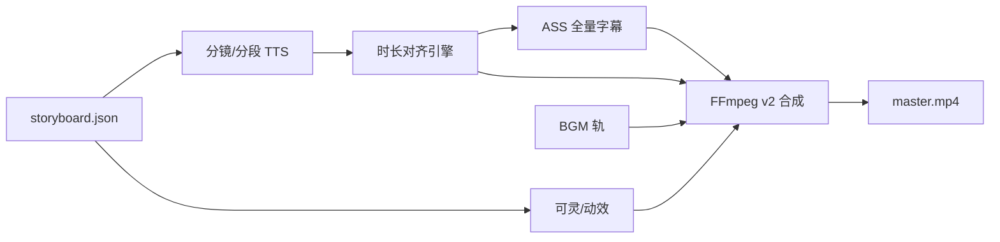

# 阶段 K：成片增强路线图（音画同步 · 动画 · 全量字幕 · BGM）

本文档在 **阶段 A～J 已完成** 的基础上，汇总全项目仍可优化项，并规划你关心的下一迭代：**解决音画不同步、画面从静图升级为动画、字幕完整呈现、可选 BGM**。

与 [`IMPLEMENTATION_ROADMAP.md`](IMPLEMENTATION_ROADMAP.md) 的关系：A～J 覆盖「能跑通 8 阶段流水线」；**阶段 K 专注 Produce / Compose 成片质量**，不改变 Plan→Publish 的主干顺序。

---

## 1. 项目扫描结论（2026-05）

### 1.1 已稳定能力

| 模块 | 状态 | 说明 |
|------|------|------|
| 8 阶段工作流 | ✅ | plan → learn，hooks、门禁、resume |
| LLM 内容链 | ✅ | DeepSeek + 百炼，连续性回退重写 |
| Produce | ✅ | 整段 TTS → 串行万相 → FFmpeg 拼接 |
| 合成 | ⚠️ 可用但简陋 | Ken Burns 静图 + 每镜一条 `drawtext` 字幕 |
| 可灵 | ❌ 未接 API | `kling.go` 占位，有 Key 也回退 Ken Burns |
| 成本 / 指标 | ✅ | cost-ledger、metrics 回流、三连跑脚本 |
| CI | ✅ | GitHub Actions `go test` + `go build` |

### 1.2 与你目标直接相关的现状差距

| 你的目标 | 当前实现 | 差距 |
|----------|----------|------|
| **音画同步** | 各镜按 `storyboard.duration_sec` 生成视频，再 **整段** `narration.mp3` 用 `-shortest` 混流 | 视频总时长与 TTS 总时长独立计算，易出现「画面播完旁白还在 / 反之」 |
| **动画而非静图** | 默认 Ken Burns；`ai_video_budget` 镜头走可灵但 **API 未实现** | 观感仍是「幻灯片」 |
| **字幕完整** | 分镜 prompt 要求 `subtitle ≤20 字`；每镜烧 **一条** 固定字幕 | 不是旁白全文逐句/逐段弹出 |
| **BGM** | 无 BGM 轨道；计划书建议剪映人工加 | 自动化管线未涉及 |

### 1.3 关键代码位置（改造入口）

| 能力 | 路径 |
|------|------|
| 合成时间轴 | `pkg/artifacts/timeline.go` → `BuildTimeline` |
| FFmpeg 合成 | `internal/compose/ffmpeg/ffmpeg.go`（`composeFromTimeline`、`muxAudio`、`kenBurnsClip`） |
| TTS | `internal/agent/producer.go` → `synthesizeNarration`（**整段 SSML 一次合成**） |
| 可灵 | `internal/provider/video/kling.go`（待实现） |
| 分镜契约 | `pkg/artifacts/storyboard.go`、`internal/agent/prompts/storyboard.go` |
| 时长门禁 | `internal/runner/gates.go` → `duration_ok`（仅校验分镜加总，不校验 TTS 对齐） |

---

## 2. 全项目优化清单（按优先级分组）

### 2.1 成片 / 媒体（阶段 K 主战场）— 见第 3 节

音画同步、动画、全量字幕、BGM。

### 2.2 Produce 工程化

| 项 | 说明 | 优先级 |
|----|------|--------|
| Kling 真实 API | 提交任务、轮询、下载 mp4 | P0 |
| 分镜 → 成片 **以音频为轴** | 先 TTS 分段时长，再反推每镜 `duration_sec` | P0 |
| 并行出图 / TTS | `errgroup` 控制并发与 429 退避 | P1 |
| 单镜 TTS | 每镜 `narration` 单独合成，便于对齐 | P0 |
| `timeline.json` v2 | 增加 `audio_start_sec`、`subtitle_events[]`、`bgm` | P0 |

### 2.3 内容与模型

| 项 | 说明 | 优先级 |
|----|------|--------|
| Storyboard prompt | 取消 subtitle 20 字上限；增加 `caption_lines[]` 或沿用 `narration` 烧字幕 | P0 |
| 分镜时长 | 由 TTS 实测驱动，而非先拍脑袋再 TTS | P0 |
| 旁白与字幕分离字段 | `narration` 全文 / `subtitle` 短句（可选） | P1 |
| 万相失败重试策略 | 已有 429 退避；可加快照一致性（参考图） | P2 |

### 2.4 平台与产品（原路线图遗留）

| 项 | 说明 | 优先级 |
|----|------|--------|
| 抖音 OpenAPI 草稿 | G4，`internal/adapter/douyin` | P2 |
| Web 只读看板 | I4，`cmd/flowagent/web` 列 runs/artifacts | P3 |
| 成本单价校准 | 当前估算偏低，对齐云账单 | P2 |
| 门禁 `condition` 表达式引擎 | 当前为字符串模式匹配 | P3 |

### 2.5 体验与运维

| 项 | 说明 | 优先级 |
|----|------|--------|
| `resume` 成功提示 | 已补 OK 行；可统一各子命令 | P3 |
| Windows UTF-8 | 已 `EnableUTF8`；文档补充 Terminal 建议 | ✅ |
| 占位 `master.mp4` 说明 | dry-run 非真视频，README 已述 | ✅ |
| 集成测试 | 增加 compose 黄金样本（短 mp3+2 图） | P2 |

---

## 3. 阶段 K 目标定义

**总目标**：`master.mp4` 达到「可直发抖音」的最低动效标准——**嘴型/节奏不违和、画面有动效、字幕跟旁白、有氛围 BGM**。

建议拆为 **K1～K5** 子阶段，按依赖顺序实施。



---

## 4. K1 — 音画同步（优先）

### 4.1 问题根因

1. **视频时长**：每镜 `duration_sec` 来自分镜 LLM 估算，Ken Burns / 裁剪按此生成。
2. **音频时长**：整段 SSML 一次 TTS，`checkAudioDuration` 只打 warn，**不反哺分镜**。
3. **混流**：`muxAudio` 使用 `-shortest`，以较短轨为准截断，**不会按镜头切分对齐**。

### 4.2 目标行为

- 以 **TTS 实测时长** 为权威时间轴（允许 ±3% 误差）。
- 每镜视频片段时长 = 该镜旁白音频时长（+ 可选 0.2s 尾静音）。
- 门禁新增：`av_sync_ok`（`|sum(video_dur) - audio_dur| ≤ 0.5s`）。

### 4.3 建议实现

| 步骤 | 任务 | 涉及 |
|------|------|------|
| K1.1 | **按镜 TTS**：`artifacts/audio/s01.mp3` … 或单文件 + `audio_segments.json`（start/end） | `producer.go`、`tts` |
| K1.2 | `timeline.json` v2 字段：`audio_start_sec`、`audio_duration_sec` | `pkg/artifacts/timeline.go` |
| K1.3 | 合成：先 `concat` 视频（可变长），再 `concat` 音频，**不用 -shortest 硬截** | `ffmpeg.go` |
| K1.4 | 可选：TTS 后调用 `ffprobe` 写回 `storyboard` 的 `duration_sec` 并 `NormalizeDurations` 保持总时长 | `producer.go` |
| K1.5 | 门禁与日志：`av_sync_ok`、produce 结束输出 `sync-report.json` | `gates.go` |

### 4.4 验收

- 人工听看：钩子句落下时画面在该镜内；整片结束旁白与画面同时结束。
- 自动化：`sync-report.json` 中 `max_drift_sec < 0.5`。

---

## 5. K2 — 动画化（可灵 + 动效策略）

### 5.1 目标

- `ai_video_budget: true` 镜头产出 **真实 mp4**（非 Ken Burns）。
- 标准档维持 **4～6 镜 / 集、每镜约 5s**（见计划书 §9.7），控制成本。
- 其余镜头：Ken Burns **或** 轻量动效（缩放/平移已有，可考虑 `minterpolate` 仅作 P2）。

### 5.2 建议实现

| 步骤 | 任务 | 涉及 |
|------|------|------|
| K2.1 | 实现可灵 OpenAPI：提交、轮询、`assets/{id}.mp4` | `internal/provider/video/kling.go` |
| K2.2 | Producer：可灵失败重试 1 次，仍失败则 Ken Burns + warn | `producer.go` |
| K2.3 | 可灵成片时长与 K1 对齐：生成后 `ffprobe`，不足则 pad 静帧/循环，过长则 trim | `ffmpeg.go` |
| K2.4 | 配置：`standard-tier.yaml` 中 `max_clips` / `clip_duration_sec` 与成本联动 | `config/stacks/` |
| K2.5 | 可选备选：万相图生视频、即梦（P2，接口调研） | 新 provider |

### 5.3 验收

- 至少 4 个镜头存在非 Ken Burns 的 `assets/sXX.mp4` 且可播放。
- 可灵镜头人物/场景有可见运动（非纯缩放静图）。

---

## 6. K3 — 全量字幕

### 6.1 问题

- 当前：每镜 **一句** `subtitle`（≤20 字）`drawtext` 烧在底栏。
- 期望：**旁白全文** 按时间轴分段显示（可逐句弹出，抖音安全区）。

### 6.2 建议实现

| 步骤 | 任务 | 涉及 |
|------|------|------|
| K3.1 | Storyboard：取消 20 字限制；`narration` 为烧录主文本；可选 `subtitle` 为短标题 | `prompts/storyboard.go` |
| K3.2 | 生成 **`artifacts/subtitles.ass`**（推荐）或 SRT：按镜拼接事件，时间码来自 K1 `audio_segments` | 新 `internal/compose/subtitles/` |
| K3.3 | FFmpeg：`-vf subtitles=subtitles.ass` 全局烧录（替代 per-clip drawtext） | `ffmpeg.go` |
| K3.4 | 样式：竖屏底部安全区、描边、字号；可配置 `subtitle_style.yaml` | `config/` |
| K3.5 | 可选 P2：按字时间戳（需 forced alignment / Whisper）实现「逐字弹出」 | 外部工具或 API |

### 6.3 字幕时间码策略（MVP）

**不引入 ASR 的 MVP**（推荐先做）：

- 每镜一条字幕事件，文本 = 该镜 `narration`，起止 = K1 的 `audio_start_sec` / `audio_duration_sec`。
- 若单镜 narration 过长，按标点拆成 2～3 条事件，时长按字符比例切分。

**增强版**（K3+）：

- 对整段旁白做 VAD/Whisper 对齐，生成句级时间轴。

### 6.4 验收

- 成片字幕覆盖 **≥95%** 旁白文本（字数统计对比 `chapter.md` / SSML）。
- 字幕切换时间点与旁白起止肉眼一致（±0.3s）。

---

## 7. K4 — BGM 与音效

### 7.1 目标

- 成片有 **低音量 BGM**，旁白时段自动 **ducking**（压低 BGM）。
- 可选：分镜 `sfx` 字段触发短音效（雨声、敲门等），与 `FlexString` 数组已兼容。

### 7.2 建议实现

| 步骤 | 任务 | 涉及 |
|------|------|------|
| K4.1 | `artifacts/bgm.mp3`：曲库路径或用户指定 `--bgm path` | CLI / `producer` |
| K4.2 | 曲库 MVP：内置 3～5 条免版权 loop（或文档说明自备路径） | `assets/bgm/` |
| K4.3 | Storyboard 增加 `bgm_mood`（悬疑/甜宠/战斗）→ 选曲映射表 | `storyboard` + config |
| K4.4 | FFmpeg：`amix` + `volume` + `sidechaincompress` 实现 ducking | `ffmpeg.go` |
| K4.5 | 可选 P2：AI 生成 BGM（Suno 等），品质档 | 新 provider |
| K4.6 | 成本记账：`bgm` 计入 `OtherCNY` 或新分项 | `cost` |

### 7.3 验收

- 旁白段落 BGM 明显让位；无旁白片头/片尾 BGM 可听清。
- 音量：BGM 峰值比旁白低约 12～18 dB（可配置）。

---

## 8. K5 — 合成管线 v2 与验收

### 8.1 `timeline.json` v2 草案

```json
{
  "episode_no": 1,
  "fps": 30,
  "resolution": "1080x1920",
  "audio": {
    "narration": "artifacts/narration.mp3",
    "bgm": "artifacts/bgm.mp3",
    "total_sec": 178.4
  },
  "subtitle_file": "artifacts/subtitles.ass",
  "shots": [
    {
      "id": "s01",
      "duration_sec": 22.1,
      "audio_start_sec": 0,
      "audio_duration_sec": 22.1,
      "visual_type": "ai_video",
      "video_path": "artifacts/assets/s01.mp4",
      "narration": "完整旁白文本……"
    }
  ]
}
```

### 8.2 合成顺序（建议）

1. 按镜生成/裁剪视频片段（时长 = `audio_duration_sec`）。
2. `concat` 视频 → `video_only.mp4`。
3. 拼接/混音旁白分段 → `narration_full.mp3`（或直接使用分段 concat）。
4. 混入 BGM（ducking）。
5. 烧录 ASS 字幕。
6. 输出 `master.mp4`。

### 8.3 端到端验收（阶段 K 完成标准）

| 编号 | 检查项 |
|------|--------|
| K-AC-1 | `accept-series-e2e.ps1 -LiveRun` 三集成功，`av_sync_ok` 通过 |
| K-AC-2 | 每集 ≥4 镜为真实图生视频（非纯 Ken Burns） |
| K-AC-3 | 字幕字数与旁白匹配（脚本统计） |
| K-AC-4 | 有 BGM 且旁白时段可辨 |
| K-AC-5 | 单集成本仍落在标准档目标区间（动效增加后允许上调 `unit_prices`） |

---

## 9. 推荐实施顺序与时间盒

| 周次 | 子阶段 | 交付物 |
|------|--------|--------|
| 第 1 周 | **K1 音画同步** | 分镜 TTS + timeline v2 + sync-report |
| 第 2 周 | **K2 可灵 API** | 4～6 镜真实 mp4 |
| 第 3 周 | **K3 全量字幕** | `subtitles.ass` + 烧录 |
| 第 4 周 | **K4 BGM** | bgm 曲库 + ducking 混音 |
| 第 5 周 | **K5 联调** | 文档、门禁、三连跑升级 |

可并行：K3 字幕 ASS 与 K1 时间轴同步设计可同一周启动（都依赖 `audio_segments`）。

---

## 10. 成本与配置影响（预估）

| 变更 | 对单集成本影响 |
|------|----------------|
| K2 可灵 5 镜 × 5s | +¥8～15（与计划书一致） |
| K1 分镜 TTS（多次调用） | TTS 调用次数 ↑，约 +¥0.5～2 |
| K4 曲库 BGM | ¥0（本地文件） |
| K3/K1 FFmpeg 本地 | ¥0 |

建议在 `standard-tier.yaml` 增加：

- `compose.subtitle_format: ass`
- `compose.bgm_enabled: true`
- `video.max_clips: 6`
- 更新 `cost_targets_cny.video` 区间

---

## 11. 与现有工作流的关系

- **不新增 YAML 阶段**：仍在 `produce` 内完成，产物增加 `subtitles.ass`、`sync-report.json`、`audio_segments.json`（可选）。
- **可选门禁**（`novel-short-douyin.yaml` produce 段）：

```yaml
gates:
  - id: av_sync_ok
    type: automatic
    condition: "artifacts.sync-report.json.max_drift_sec <= 0.5"
```

- **剪映**：K 完成后，剪映仅作 **终审**（调色、封面微调），而非必做字幕/BGM。

---

## 12. 文档与路线图索引

| 文档 | 用途 |
|------|------|
| 本文档 | 阶段 K 需求与任务拆解 |
| [`IMPLEMENTATION_ROADMAP.md`](IMPLEMENTATION_ROADMAP.md) | A～J 总览；可在 §0 增加「阶段 K → 本文档」链接 |
| [`PHASE_E_SUMMARY.md`](PHASE_E_SUMMARY.md) | 当前 Produce 实现说明 |
| [`NOVEL_STREAM_VIDEO_PUBLISH_PROPOSAL.md`](NOVEL_STREAM_VIDEO_PUBLISH_PROPOSAL.md) §9.7～9.8 | 可灵用量与 BGM 产品约定 |

---

## 13. 下一步行动（建议你现在可做）

1. **确认优先级**：是否同意 `K1 → K2 → K3 → K4` 顺序（音画同步应先于全量字幕）。
2. **准备可灵 Key**：`config/providers.local.yaml` 中 `kling.api_key`（K2 阻塞项）。
3. **准备 BGM 素材**：自备 2～3 条 180s 可循环 mp3，或指定免版权曲库路径（K4）。
4. 开发启动时 say：**「开始做阶段 K1」**，将从分镜 TTS + `timeline` v2 改起。

---

*文档版本：1.0 · 阶段 A～J 已验收后的成片增强规划*
