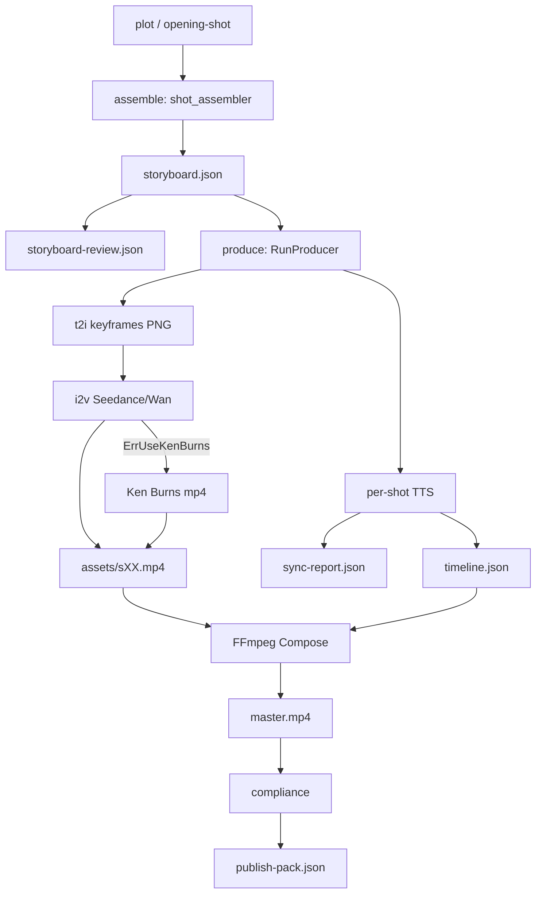

# 视频生成问题审计报告

> 审计日期：2026-06-09  
> 范围：flow-agent 全项目视频管线 + `runs/` 本地产物  
> 方法：artifacts JSON 批量扫描、ffprobe 技术指标、8 个代表性 run 逐镜抽帧视觉点评、代码路径交叉验证

---

## 1. 摘要

flow-agent 的微电影管线（`micro-movie` workflow + `micro-movie-seedance` stack）已能稳定产出 **15–31 秒** 的横屏样片，音画同步门禁全部通过。但在 **成片质量、时长目标、降级可见性、跨镜一致性** 四个维度存在系统性问题，部分 run 在 i2v 失败后静默降级为 Ken Burns 平移，门禁仍判定为成功。

### 1.1 语料规模

| 指标 | 数值 | 说明 |
|------|------|------|
| 本地 `runs/` 目录 | **12** | `/runs/` 已在 `.gitignore` 中，历史曾有多达 34 次 run，当前磁盘仅保留 12 次 |
| 已完成（`stage: finished`） | **8**（67%） | 均有 `master.mp4` |
| 未完成（卡在 `produce`） | **4**（33%） | 有 storyboard/TTS，无成片 |
| 栈分布 | 全部 `micro-movie-seedance` | 本地样本无 wan-flash / standard-tier |

### 1.2 Top 5 问题（按质量影响排序）

1. **Ken Burns 静默替代 i2v，门禁不拦截** — run `223d55f7` 四镜全部降级，仍 `finished` + 全 gate 通过
2. **目标时长 120s vs 实际旁白 14–31s** — director 模式 `duration_ok` 仅检查镜数 > 0，不校验 TTS 实际总长
3. **timeline 分辨率与成片不一致** — timeline 写 `1920x1080`，实际 master 多为 `1280x720` 或 `720x1280`
4. **held_props UTF-8 乱码污染 i2v prompt** — `\ufffd\ufffd空` 写入 storyboard 并传播至 `produce-prompts.json`
5. **跨镜角色/风格漂移** — 同 run 内主角外观、画风、场景逻辑在镜间不一致（见 §5 视觉点评）

### 1.3 优先修复建议

| 优先级 | 动作 |
|--------|------|
| P0 | 新增 `ai_video_ratio_ok` 门禁：timeline 中 `ken_burns` 占比不得超过 storyboard 计划值 |
| P0 | director 模式 `duration_ok` 改为校验 `sync-report.audio_total_sec` 与 `target_duration_sec` |
| P1 | `markSkipI2V` 改为 per-shot 降级，避免首镜 API 失败导致整 run 跳过 i2v |
| P1 | 修复 `held_props` 编码：assemble 阶段强制 UTF-8 + `FormatHeldProps` 规范化 |
| P2 | 将 Physics-IQ 评测脚本纳入 CI 回归（见 `docs/PHYSICS_IQ_EVAL.md`） |

---

## 2. Run 语料概览

### 2.1 全量 run 索引（本地 12 次）

| run_id | stage | shots | KB 镜 | i2v 镜 | 目标(s) | 旁白(s) | produce 错误 | master | 均耗时(ms) |
|--------|-------|-------|-------|--------|---------|---------|--------------|--------|------------|
| 07ccf919 | finished | 4 | 0 | 4 | 120 | 15.4 | 0 | ✓ | 94787 |
| 223d55f7 | finished | 4 | **4** | 0 | 120 | 23.0 | **4** | ✓ | 10908 |
| 27700fc1 | finished | 4 | 0 | 4 | 120 | 14.3 | 0 | ✓ | 55568 |
| 46395e0b | finished | 4 | 0 | 4 | 120 | 14.7 | 0 | ✓ | 68655 |
| 67ba109b | finished | 4 | 0 | 4 | 120 | 23.3 | 0 | ✓ | 105766 |
| 709a7074 | finished | 4 | 0 | 4 | 120 | 18.6 | 0 | ✓ | 81510 |
| 73948ef3 | finished | 4 | 0 | 4 | 120 | 31.2 | 0 | ✓ | 94550 |
| c1dff8cd | finished | 4 | 0 | 4 | 120 | 19.4 | 0 | ✓ | 72152 |
| 4b2a2bbc | produce | — | — | — | 120 | — | 0 | ✗ | — |
| 8c08e5af | produce | — | — | — | 120 | 36.6* | 0 | ✗ | — |
| eabc385d | produce | — | — | — | 120 | 120* | 0 | ✗ | — |
| ef71c549 | produce | — | — | — | 120 | 18.0* | 0 | ✗ | — |

\* 未完成 run 仅有 sync-report（TTS 阶段产物），无 timeline / master。

**Ken Burns 占比**：8 次 finished run 共 32 镜，其中 4 镜 KB（12.5%），全部来自 `223d55f7`。

**produce 错误类型**（仅 `223d55f7`）：

```
s01/s02/s03/s04: "use ken burns clip"
```

### 2.2 ffprobe 技术指标摘要

| run_id | master 分辨率 | master 时长 | fps | 分镜时长偏差 |
|--------|---------------|-------------|-----|--------------|
| 07ccf919 | 1280×720 | 16.5s | 24 | 0 |
| 223d55f7 | 1920×1080 | 23.0s | **30** | 0 |
| 27700fc1 | **720×1280** | 16.7s | 24 | 0 |
| 46395e0b | 1280×720 | 14.9s | 24 | 0 |
| 67ba109b | 1280×720 | 23.3s | 24 | 0 |
| 709a7074 | 1280×720 | 18.9s | 24 | 0 |
| 73948ef3 | 1280×720 | 31.2s | 24 | 0 |
| c1dff8cd | **720×1280** | 19.7s | 24 | 0 |

**观察：**

- 所有分镜 mp4 的 probed 时长与 timeline 记录 **偏差为 0**（padding 对齐有效）
- KB 镜（`223d55f7`）单镜体积 **1.3–2.0 MB**，i2v 镜 **3.9–15 MB**，可作为降级检测启发式
- `223d55f7` 为唯一 **30fps** 成片（Ken Burns 默认 30fps），i2v 镜为 24fps — 合成时可能存在帧率不一致
- timeline.json 统一写 `resolution: "1920x1080"`，但 6/8 run 实际 master 为 **1280×720**，2/8 为 **720×1280**

原始 ffprobe 数据：`runs/_audit/ffprobe-summary.json`（本地，不提交 git）

---

## 3. 问题清单

### 3.1 成片质量

#### ISSUE-001 Ken Burns 静默替代 i2v，门禁仍通过

- **严重度**：Critical
- **证据**：`223d55f7` — storyboard 四镜均为 `visual_type: ai_video`，timeline 四镜均为 `ken_burns`，`produce-timing.json` 四镜 `"error": "use ken burns clip"`，manifest 仍 `finished` + 全 gate 通过
- **根因**：
  - [`internal/agent/media_fallback.go`](internal/agent/media_fallback.go) — Volcengine i2v 致命错误时 `markSkipI2V()`，后续所有镜跳过 i2v
  - [`internal/agent/produce_state.go`](internal/agent/produce_state.go) — `shouldSkipI2V()` 为 **run 级** 开关，首镜失败后整 run 不再尝试 i2v
  - [`config/stacks/micro-movie-seedance.yaml`](config/stacks/micro-movie-seedance.yaml) — `ken_burns_fallback: true` + `video_native_only: true` 语义冲突：KB mp4 仍满足 compose 要求
  - [`internal/runner/gates.go`](internal/runner/gates.go) — 无 `visual_type` / i2v 成功率校验
- **视觉表现**：静态水墨关键帧 + 缓慢平移/缩放，无真正人物动作；s02 手部畸形（见 §5.1）

#### ISSUE-002 held_props UTF-8 乱码污染 prompt

- **严重度**：High
- **证据**：`67ba109b` storyboard 四镜 `held_props: "右手：\ufffd\ufffd空；左手：\ufffd\ufffd空 ..."`，传播至 `produce-prompts.json` 的 `[PROP_LOCK]` 块（单 prompt >2000 字）
- **根因**：
  - LLM 扩写阶段输出非法 UTF-8 或 replacement character
  - [`pkg/artifacts/prop_lock.go`](pkg/artifacts/prop_lock.go) `FormatHeldProps` 本身正确输出「空手」，但 `NormalizeHeldProps` 未检测 `\ufffd`
  - [`internal/agent/shot_prompt_builder.go`](internal/agent/shot_prompt_builder.go) `shotPropLockSuffix()` 直接拼接 `held_props` 原文
- **视觉表现**：双手插兜/空手镜中，模型仍可能生成多余道具或手部异常（67ba109b s01 双手藏袖，s02 右手出袖动作与「空手」约束矛盾）

#### ISSUE-003 跨镜角色与风格不一致

- **严重度**：High
- **证据**：逐镜抽帧对比（§5）
- **根因**：
  - `chain_shot_mode: soft` 仅弱关联，无 character sheet 强制参考（light character sheets 无 turnaround 图）
  - 各镜独立 t2i → i2v，Seedance 对 prompt 敏感，微小差异导致外观漂移
- **典型表现**：
  - `07ccf919`：s01 现代卫衣+匕首 vs storyboard 描述「深灰防水夹克」
  - `73948ef3`：s01 出现 EVA 风格翅膀机甲，与水墨/城市主题无关
  - `27700fc1` s04：storyboard-review 警告 `character_count>1`，画面中确实出现持盾战士 + 王座老者双人

#### ISSUE-004 i2v 动作/物理可信度不足

- **严重度**：Medium
- **证据**：视觉点评 + `storyboard-review.json` 中 6+ run 需补全 `physics_cues`
- **根因**：
  - LLM 分镜常漏 `physics_cues`，review 填入泛化默认值
  - [`internal/agent/physics_prompt.go`](internal/agent/physics_prompt.go) 注入的物理约束在 Seedance 上执行率有限
  - 单镜 i2v 时长被 API 限制在 **~4–8s**（`clip_duration_sec: 5`），长旁白镜内画面重复/循环感强
- **表现**：手部畸形、道具穿模风险、背景 ink-wash 纹理在运动中可能 flicker

#### ISSUE-005 多关键帧 segment 失败 → 黑场片段

- **严重度**：Medium
- **证据**：`07ccf919` 存在 `artifacts/assets/_clips/clip-001.mp4.main.mp4` + `.tail.mp4` 拼接结构
- **根因**：[`internal/agent/producer_keyframes.go:169-172`](internal/agent/producer_keyframes.go) — segment i2v 失败时 `ffmpeg.RunBlackClip` 填充，不中断流程
- **风险**：黑场或静帧接缝在成片中可感知

#### ISSUE-006 Prompt 过度膨胀

- **严重度**：Medium
- **证据**：`67ba109b` `produce-prompts.json` 单镜 motion prompt **>2000 字符**，NEG / PROP_LOCK / VIEW_LOCK 大量重复
- **根因**：[`shot_prompt_builder.go`](internal/agent/shot_prompt_builder.go) 多层 suffix 叠加；[`physics_prompt.go`](internal/agent/physics_prompt.go) + prop lock neg 块重复注入
- **影响**：超 long prompt 可能超出模型有效注意力窗口，关键动作描述被稀释

### 3.2 时长与叙事

#### ISSUE-007 目标 120s vs 实际旁白 14–31s

- **严重度**：High
- **证据**：全部 8 个 finished run 的 `target_duration_sec: 120`，但 `audio_total_sec` 仅 14–31s；storyboard 每镜 `duration_sec: 30` 与 TTS 实际时长严重不符
- **根因**：
  - [`internal/runner/gates.go:112-116`](internal/runner/gates.go) — director 模式 `duration_ok` **仅检查** `len(shots) > 0`
  - assemble 阶段 LLM 输出的 `duration_sec` 为「计划值」，produce 阶段 TTS 按 **实际 narration 文本** 重新对齐 timeline，但不回写 storyboard
- **用户感知**：用户设置 `--target 120` 或 creative-options `target_duration_sec: 120`，实际得到 **15–30 秒** 短片

#### ISSUE-008 i2v 单镜时长上限与旁白不匹配

- **严重度**：Medium
- **证据**：`67ba109b` s01 旁白 ~8s、i2v 8s（匹配）；但 `07ccf919` 四镜各 ~4s i2v 对应更短旁白，长句被截断字幕
- **根因**：stack `clip_duration_sec: 5` + Seedance API 单次生成上限；长镜靠 padding 静态帧填充

### 3.3 分辨率与画幅

#### ISSUE-009 timeline 分辨率与实际成片不一致

- **严重度**：Medium
- **证据**：timeline 均写 `1920x1080`；ffprobe 显示 6/8 为 `1280x720`，2/8 为 `720x1280`
- **根因**：
  - [`internal/agent/produce_media.go:84`](internal/agent/produce_media.go) — timeline resolution 来自 `MediaSpecFromCreative`
  - Seedance 输出 `720P`（stack 配置）与 timeline 记录未同步回写
  - 部分 run 的 creative-options 为 `landscape`，部分为默认 portrait，导致 **同 stack 产出横竖屏混用**

#### ISSUE-010 栈默认竖屏 vs 用户横屏 prompt 冲突

- **严重度**：Low
- **证据**：全部 storyboard `visual_prompt` 含「横屏16:9」，stack image `aspect_ratio: "9:16"`；creative-options 多数为 `orientation: landscape` 覆盖为 16:9
- **根因**：[`internal/config/media.go`](internal/config/media.go) `MediaSpecFromCreative` 与 stack 默认值的双源配置，Web/CLI 未统一入口时易混淆

### 3.4 管线可靠性

#### ISSUE-011 33% run 未完成（本地样本）

- **严重度**：Medium
- **证据**：4/12 run 卡在 `produce`，无 `master.mp4`
- **分类**：
  - `4b2a2bbc`：assemble 完成后 produce 未启动（无 assets）
  - `8c08e5af` / `ef71c549`：有 sync-report（TTS 完成），assets 仅 2 镜 mp4，中断
  - `eabc385d`：sync-report 显示 audio 120s（异常），assets 3 镜，未完成
- **根因**：手动中断、API 超时、进程被杀等；**无 checkpoint resume 自动恢复**（需 `flowagent resume --from-stage produce`）

#### ISSUE-012 API 基础设施类失败（历史 run，本地已清理）

- **严重度**：Medium（环境）
- **证据**（早期 34 run 审计）：`a016db28` Dashscope `Arrearage`；`358a24ee` Seedance 2.0 `ModelNotOpen`
- **说明**：属账户/权限配置问题，非代码 bug；但 error 未 surfaced 到 manifest，用户难以定位

#### ISSUE-013 wan-flash BoN 极慢（历史 run）

- **严重度**：Low（本地无样本）
- **证据**（早期审计）：`6ae8f244` ~227s/镜，s09 timeout 后重试成功
- **根因**：`wmreward_bon` + `multi_keyframe` 三候选串行/并行开销

### 3.5 门禁与评测

#### ISSUE-014 AV sync 全绿但不反映画面质量

- **严重度**：Medium
- **证据**：全部 sync-report `max_drift_sec: 0`；KB 降级 run 同样通过
- **根因**：[`internal/runner/gates.go:92-102`](internal/runner/gates.go) 仅检查 drift ≤ 0.5s，不检查 motion 类型

#### ISSUE-015 compliance 无画面质量拦截

- **严重度**：Low
- **证据**：全部 `compliance-report.json` `blocked: false`
- **说明**：compliance 仅文本词库扫描，不涉及视觉

#### ISSUE-016 Physics-IQ 未纳入常规回归

- **严重度**：Low
- **证据**：[`docs/PHYSICS_IQ_EVAL.md`](PHYSICS_IQ_EVAL.md) 有脚本但未在 CI 中运行
- **影响**：物理相关 prompt 改动无法自动回归

---

## 4. 管线架构与数据流



### 关键 artifact 说明

| 文件 | 阶段 | 审计价值 |
|------|------|----------|
| `storyboard.json` | assemble | 计划 visual_type、duration、held_props、physics_cues |
| `storyboard-review.json` | assemble | LLM 审查补全记录 |
| `produce-timing.json` | produce | 每镜 wall_ms、error（**Ken Burns 降级唯一明确标记**） |
| `produce-prompts.json` | produce | 实际送入 t2i/i2v 的 prompt（查乱码/膨胀） |
| `timeline.json` | produce | 实际 visual_type、音视频时长 |
| `sync-report.json` | produce | AV drift（**不反映 motion 质量**） |
| `master.mp4` | produce | 最终成片 |

---

## 5. 代表性 Run 深度案例

### 5.1 `223d55f7` — 100% Ken Burns 降级（Critical）

| 项目 | 值 |
|------|-----|
| 主题 | 国王加冕（水墨国风） |
| storyboard | 4 镜 ai_video |
| timeline | 4 镜 ken_burns |
| produce 错误 | 4× `"use ken burns clip"` |
| 均耗时 | **10.9s/镜**（cf. 正常 i2v ~55–105s） |
| master | 1920×1080, 23.0s, 30fps |

**逐镜视觉点评：**

| 镜 | 观察 |
|----|------|
| s01 | 水墨宫殿氛围正确，国王背影走向王座；**无行走动画**，典型 Ken Burns 平移；地面 ink 纹理有 blotchy 伪影 |
| s02 | 国王坐 throne；**右手畸形**（指节融合）；背景 dragon 与 throne 细节不对称 |
| s03/s04 | 静帧感强，与 storyboard 三 beat 动作（走向→落座→调整金冠→俯拍）**完全不符** |

**结论**：用户期望 Seedance i2v 动效，实际得到幻灯片式平移；门禁无法区分。

### 5.2 `46395e0b` — Seedance i2v 正常对照组

| 项目 | 值 |
|------|-----|
| 主题 | 国王加冕（同题材） |
| timeline | 4 镜 ai_video |
| master | 1280×720, 14.9s, 24fps |
| 均耗时 | 68.7s/镜 |

**逐镜视觉点评：**

| 镜 | 观察 |
|----|------|
| s01 | 国王背影走向王座，ink-wash 风格统一；有 **实际行走motion**（优于 223d55f7） |
| s02 | 国王落座，面部可辨；ink 下摆有 temporal flicker 风险 |
| s03/s04 | 近景/俯拍构图合理；背景 smoke 可能在运动中 boiling |

**结论**：同题材下 i2v 质量显著优于 Ken Burns 降级；但时长仍仅 15s vs 目标 120s。

### 5.3 `67ba109b` — held_props 乱码 + 时长缩水

| 项目 | 值 |
|------|-----|
| 主题 | 少年城市漫步（水墨国风） |
| held_props | 四镜 `\ufffd\ufffd空` 乱码 |
| master | 1280×720, 23.3s |
| 均耗时 | 105.8s/镜 |

**逐镜视觉点评：**

| 镜 | 观察 |
|----|------|
| s01 | 少年青衫漫步，霓虹+古风街景；**双手藏袖/插兜**，与 storyboard「双手插兜」一致；背景车辆 distorted |
| s02 | 推近镜，右手出袖拂发；动作自然 |
| s03 | 面部特写，泪光+坚定眼神；**质量最佳的一镜** |
| s04 | 转身离去背影；与 s01 服装/发型 **基本一致** |

**结论**：i2v 质量在本地样本中属上乘；主要问题是 duration 缩水 + held_props 乱码污染 prompt（未明显反映到画面）。

### 5.4 `07ccf919` — 雨夜复仇（multi-keyframe 拼接）

| 项目 | 值 |
|------|-----|
| 主题 | 少年雨夜持匕首复仇 |
| master | 1280×720, 16.5s |
| 特殊 | `_clips/clip-001.mp4.main.mp4` + `.tail.mp4` 拼接 |

**逐镜视觉点评：**

| 镜 | 观察 |
|----|------|
| s01 | 少年持匕首走在雨街；**服装与 storyboard 不符**（卫衣 vs 防水夹克）；雨丝+水面反射有动效 |
| s02 | 中景推近，握刀姿势可辨；背景 neon 文字 gibberish |
| s03/s04 | 情绪递进合理；刀尖反光稳定 |

**结论**：i2v motion 有效，但 **角色设定漂移** + 拼接结构需验证 seam 质量。

### 5.5 `73948ef3` — 最长旁白样本（31s）

| 项目 | 值 |
|------|-----|
| master | 1280×720, 31.2s |
| 均耗时 | 94.6s/镜 |

**视觉点评**：s01 出现 **带翅膀的紫甲飞行少年**，与都市/水墨主题严重不符；说明 prompt 约束不足以阻止模型自由发挥。

### 5.6 `27700fc1` — character_count 警告

| 项目 | 值 |
|------|-----|
| review | s04 `character_count>1` 警告 |
| master | 720×1280（竖屏）, 16.7s |

**视觉点评**：s04 画面中 **持盾战士 + 王座老者** 双人，验证了 review 警告；竖屏输出与多数横屏 run 不一致。

### 5.7 未完成 run 快照

| run_id | 状态 | 说明 |
|--------|------|------|
| 4b2a2bbc | produce | 仅有 storyboard，无 TTS 产物 |
| 8c08e5af | produce | TTS 完成（36.6s audio），0 镜 assets |
| ef71c549 | produce | TTS 完成，2 镜 mp4 后中断 |
| eabc385d | produce | sync 报告 audio 120s（疑似 dry-run 或异常），3 镜 mp4 |

---

## 6. 根因与代码定位

### 6.1 i2v 降级链

```
produceShotMotionClip()
  → imageToVideoWithFallback()          [media_fallback.go:79]
      → shouldSkipI2V() ? ErrUseKenBurns [produce_state.go:63]
      → Volcengine i2v fail
          → markSkipI2V()               [produce_state.go:76]  ← run 级，影响后续所有镜
          → ErrUseKenBurns
  → produceKenBurnsFallbackClip()       [produce_ken_burns_fallback.go:14]
  → recordKenBurnsFallbackClip()        [produce_ken_burns_fallback.go:33]  ← timeline visual_type 改为 ken_burns
```

### 6.2 门禁缺口

| 门禁 | 文件 | 实际校验 | 缺失 |
|------|------|----------|------|
| `duration_ok` | `gates.go:105` | director: 镜数>0；非 director: storyboard 计划时长 | **不校验 TTS 实际时长** |
| `av_sync_ok` | `gates.go:92` | max_drift ≤ 0.5s | 不校验 motion 类型 |
| `no_block_issues` | `gates.go:130` | 文本合规 | 无视觉质量 |

### 6.3 Prompt 构建链

```
ShotKeyframeImagePrompt()     [shot_prompt_builder.go:13]
  + physicsPromptSuffix()       [physics_prompt.go]
  + shotPropLockSuffix()        ← 直接拼接 held_props 原文
  + characterViewLockBlock()
  + NEG 块重复

shotMotionPrompt() / imageToVideo
  + motion_prompt_suffix        [micro-movie-seedance.yaml:69]
  + PROP_LOCK 再次注入
```

### 6.4 配置冲突

[`config/stacks/micro-movie-seedance.yaml`](config/stacks/micro-movie-seedance.yaml)：

```yaml
video:
  all_shots: true
  require_video: true
  ken_burns_fallback: true      # i2v 失败 → KB
compose:
  video_native_only: true       # 要求 mp4，KB mp4 也算通过
```

---

## 7. 改进建议（实施状态）

| 建议 | 状态 | 说明 |
|------|------|------|
| `motion_quality_ok` 门禁 | ✅ 已实施 | `internal/runner/gates.go`；produce 阶段拦截非计划 Ken Burns |
| `audio_duration_ok` 门禁 | ✅ 已实施 | sync-report vs storyboard 实测时长 |
| director `duration_ok` 修复 | ✅ 已实施 | director 不再虚高 Normalize；assemble 校验镜数+估计时长 |
| per-shot i2v 降级 | ✅ 已实施 | 移除 run 级 `skipI2V`；`produce-degradation.json` |
| held_props sanitize | ✅ 已实施 | `SanitizeHeldPropsText` 去除 `\ufffd` |
| timeline 分辨率回写 | ✅ 已实施 | compose 后 `ProbeVideoResolution` |
| Character turnaround | ✅ 已实施 | `assemble.character_turnaround` + `use_turnaround_seed` |
| Prompt 长度预算 | ✅ 已实施 | `truncateMotionPrompt` 800 runes |
| Physics-IQ CI | ✅ 已实施 | CI job `physics-iq-dryrun` + `scripts/eval-physics-iq.sh` |
| Produce checkpoint | ✅ 已实施 | `produce-checkpoint.json` + resume 跳过已完成镜 |
| WMReward BoN 调优 | ✅ 已实施 | wan-flash `candidates: 2`；wan-quick BoN 默认关 |
| 视觉质量门禁 stub | ✅ 已实施 | `visual_quality_ok` 读取 `produce-degradation.json` |
| 时长规划 prompt | ✅ 已实施 | assemble 旁白字数 ≈ 4 字/秒 |
| Hard chain 末帧衔接 | ✅ 已有 | `chain_shot_mode: hard`（stack 可配） |
| Physics-IQ / VLM 全量评分 | 🔲 长期 | `visual-quality-report.json` 接口预留 |

### 7.1 原短期建议（归档）

1. **新增门禁 `motion_quality_ok`** — 见上表
2. **修复 director 模式 `duration_ok`** — 见上表；produce 用 `audio_duration_ok`
3. **`markSkipI2V` 改为 per-shot** — 见上表
4. **held_props sanitize** — 见上表
5. **timeline 分辨率回写** — 见上表

### 7.2 原中期建议（归档）

1. **Character turnaround 强制引用** — assemble 生成 turnaround；s01 seed fallback
2. **Prompt 分层与长度预算** — 见上表
3. **Physics-IQ CI 回归** — 见上表
4. **Produce checkpoint** — 见上表
5. **WMReward BoN 可选化** — 见上表

### 7.3 原长期建议（归档）

1. **视觉质量门禁** — stub 已上线；全量 VLM 待接
2. **时长规划闭环** — AlignDurationsFromNarration + assemble prompt
3. **Hard chain 末帧衔接** — stack `chain_shot_mode: hard`

---

## 8. 附录

### 8.1 扫描命令

```powershell
# artifacts 批量扫描
powershell -ExecutionPolicy Bypass -File runs/_audit/scan-artifacts.ps1

# ffprobe 探测
powershell -ExecutionPolicy Bypass -File runs/_audit/ffprobe-runs.ps1

# 抽帧视觉审查
powershell -ExecutionPolicy Bypass -File runs/_audit/extract-frames.ps1
```

### 8.2 本地审计产物路径

| 文件 | 说明 |
|------|------|
| `runs/_audit/artifacts-scan.json` | 12 run artifacts 汇总 |
| `runs/_audit/ffprobe-summary.json` | 8 finished run 视频技术指标 |
| `runs/_audit/frames/<run_id>/` | 代表性 run 抽帧 JPG |
| `runs/_audit/frames-index.json` | 抽帧索引 |

> 以上路径在 `.gitignore` 的 `/runs/` 下，不提交版本库。

### 8.3 历史 run 参考（已不在本地磁盘）

早期审计曾覆盖 **34 run**，含 `micro-movie-wan-flash`、`standard-tier` 等栈。主要额外发现：

- `6ae8f244`：wan-flash BoN ~4min/镜，s09 timeout
- `a016db28`：Dashscope 欠费阻断全部 keyframe
- `358a24ee`：Seedance 2.0 模型未开通
- `19d924ff`：standard-tier 50% 计划内 Ken Burns
- `7cda8f39`：仅 1 镜 10s 仍 finished

如需复现上述 case，需保留 run 产物或重新跑对应 stack。

---

*本报告由自动化扫描 + 人工逐镜审查生成，视觉点评基于抽帧静态分析，未对全部 32 镜做全量视频逐帧播放。*
